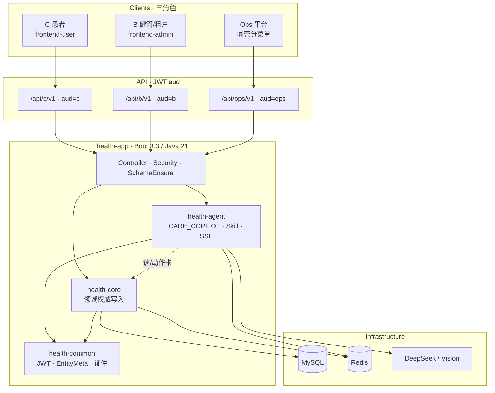

# Healix · 整体技术实现方案

| 项 | 内容 |
|---|---|
| 版本 | **v1.0** |
| 日期 | 2026-09-24 |
| 依据 | 当前仓库落地代码 + `SaaS架构.md` / `数据模型.md` / Agent 专项文档 |
| 范围 | **整体架构** · **数据库设计** · **Agent 架构与实现** |
| 读者 | 组内研发 / 技术评审 |

> 本文描述**当前已落地**的实现口径，不是远期愿望清单。产品演示口径见 `Healix-产品与技术介绍.html`、`组内技术分享-Healix健管智能体.md`。  
> 浏览器可读版：[`Healix-整体技术实现方案.html`](./Healix-整体技术实现方案.html)。

---

## 0. 摘要

Healix 是面向医疗机构的多租户健管 SaaS：

- **三角色**：C 患者 / B 健管（含租户管理）/ Ops 平台，分入口、分 JWT `aud`。
- **后端形态**：Spring Boot **Modulith 单体**（`health-app` 统一暴露 API），领域与智能体分模块。
- **B 端主入口**：**智能驾驶舱**（对话驱动）+ 传统菜单底座（患者 / 任务 / 随访 / 方案 / 观测…）。
- **AI 原则**：**起草与预填**；**人确认后才写业务库**（方案 publish、OCR 确认入库、任务/随访提交）。

```text
用户端                    统一 API                       模块
─────────                 ────────                       ────
frontend-user  ──►  /api/c/v1/**     ─┐
frontend-admin ──►  /api/b/v1/**     ─┼─► health-app
               ──►  /api/ops/v1/**   ─┘        │
                                               ├─ health-core   领域服务
                                               ├─ health-agent  CARE_COPILOT
                                               └─ health-common 基础设施
                                               │
                                    MySQL · Redis · DeepSeek(Spring AI)
```

---

## 1. 整体架构设计

### 1.0 架构总览

> 浏览器可读版见 [`Healix-整体技术实现方案.html`](./Healix-整体技术实现方案.html) 中的分层架构图。



**分层读法：** 客户端 → 分 aud API → app 鉴权与路由 → agent（起草）与 core（落库）→ MySQL / Redis / LLM。

### 1.1 设计目标

| # | 目标 | 落地方式 |
|---|---|---|
| 1 | 多租户可运营 | 行级 `tenant_id` + 机构工作上下文 |
| 2 | 账号与权限隔离 | C/B/Ops 三套账号 + JWT `aud` |
| 3 | 业务可演进 | Modulith 模块边界，先单体后按需拆 |
| 4 | AI 可追责 | 模型不直写业务表；动作卡调现有 B API |
| 5 | 对话即工作台 | 驾驶舱 SSE + Skill 路由 + 动作卡 |

### 1.2 仓库与模块

| 路径 | 职责 |
|---|---|
| `backend/health-common` | 通用模型、`EntityMeta`、JWT、身份证加解密、`IdCardUtil`、异常与结果封装 |
| `backend/health-core` | **领域核心**：租户/机构/员工、患者档案、观测、方案、任务、随访、报告、沟通、驾驶舱查询、定时任务… |
| `backend/health-agent` | **智能体**：`StaffAgentGateway`、Skill、LLM、OCR、会话记忆、SSE 事件 |
| `backend/health-app` | Boot 启动、Controller（`/api/c|b|ops/v1`）、Schema 保障、安全过滤器 |
| `frontend-admin` | B + Ops 同壳（Vue） |
| `frontend-user` | C 端 H5 |

**技术栈（当前）：** Java 21 · Spring Boot 3.3 · MyBatis · JWT · Spring AI / DeepSeek · Redis · Vue 管理端。

### 1.3 运行时分层

```text
┌─────────────────────────────────────────────────────────────┐
│  Controller（health-app）                                     │
│  BAgentController / BWorkspace* / BFollowup* / …            │
├─────────────────────────────────────────────────────────────┤
│  Security：JWT 解析 · aud 校验 · 当前租户/机构/员工注入        │
├─────────────────────────────────────────────────────────────┤
│  Agent 网关（可选）          │  领域服务（health-core）         │
│  StaffAgentGateway          │  OrgWorkspace / WorkspaceTask │
│  Skills + LlmClient         │  Followup / CarePlan / Lab…   │
├─────────────────────────────┴───────────────────────────────┤
│  Mapper / MyBatis XML · Redis · 外部 LLM / Vision           │
└─────────────────────────────────────────────────────────────┘
```

### 1.4 多租户与机构模型

| 概念 | 含义 |
|---|---|
| **租户 tenant** | SaaS 客户边界；患者 `people` 归属单租户 |
| **机构 organization** | B 端工作边界；员工切换 `currentOrgId` |
| **健管组 care_team** | 机构内网格；成员含 STAFF / PATIENT |
| **入组 membership** | `people_org_membership`；ACTIVE 才在机构患者列表可见 |

**隔离约定（执行口径）：**

| 数据类型 | 隔离 |
|---|---|
| 体征 / 检验 / 检查报告 | **租户共享**（同租户机构可见历史） |
| 工作台任务 / 随访记录 | **机构隔离**（`org_id`） |
| Agent 会话（B 健管） | 按租户 + 员工 +（可选）患者 / 机构会话 |
| C 端患者私聊 | 与 CARE_COPILOT **记忆隔离**（双 Agent） |

### 1.5 认证与 API 分区

| 入口 | 前缀 | Token |
|---|---|---|
| C | `/api/c/v1/**` | `aud=c` |
| B | `/api/b/v1/**` | `aud=b`，带 `tenantId` / `staffId` / `currentOrgId` |
| Ops | `/api/ops/v1/**` | `aud=ops` |
| 公开 | `/api/public/v1/**` | 极少 |

管理端登录页三分入口：**平台超管 / 租户管理 / 机构工作台**——菜单与 `aud`、角色绑定，互不串用。

### 1.6 B 端主链路：智能驾驶舱

```text
今日优先（CockpitService）
    → 选患者 focus（档案完整度 / 依从 / OPEN 任务 / 待确认草稿）
    → POST /api/b/v1/agent/chat/stream  （SSE）
    → StaffAgentGateway 路由 Capability
    → Skill 执行（可带 LLM / OCR / 工具）
    → 回复 + AgentAction[] 落会话
    → 前端动作卡 → 现有 B API 或 WorkspaceTaskFormDialog
    → 人确认 → 业务表
```

**会话两层：**

| 会话 | `peopleId` | 能力约束 |
|---|---|---|
| **机构会话** | 空 | 强制偏 `GENERAL_CHAT`；引导点人；不可直接方案/OCR 写库路径 |
| **患者会话** | 有 | 可方案 / OCR / 办结 / 报告点评 |

### 1.7 前端结构（B）

- 布局：`WorkspaceLayout` 侧栏（驾驶舱、工作台、患者管理、患者沟通、依从、报告、运营统计…）。
- 驾驶舱：`CockpitView` 三栏 + Sheet 抽屉复用患者详情能力。
- 代理：Vite 将 `/api` 转到后端 `8080`。

### 1.8 为何 Modulith 不先拆微服务

- 用模块表达边界（core / agent / app），降低运维成本。
- Agent 强依赖领域服务与同一事务边界（办结、确认入库）。
- 边界清晰后再按调用热点拆（例如 OCR/LLM 异步 worker）。

---

## 2. 数据库设计

### 2.1 通用约定

| 约定 | 说明 |
|---|---|
| 库 | MySQL 8.0 / `utf8mb4` |
| 双主键 | `pk_id` BIGINT 自增物理主键；`id` VARCHAR(32) 雪花业务主键（UK） |
| 外联 | `tenant_id` / `org_id` / `people_id` / `staff_id` 等指向对方 **`id`** |
| 软删 | `is_deleted` + `gmt_deleted`（未删默认 `9999-12-31 23:59:59`） |
| 时间 | `gmt_created` / `gmt_modified`；业务时刻 `DATETIME` |
| 写入 | `EntityMeta.onCreate` / `onUpdate` / `onSoftDelete` |
| Schema | 主 DDL + `SchemaEnsureRunner` 启动保障增量表 |

### 2.2 逻辑 ER（核心）

```text
tenant 1───* organization
                ├──* staff_org_binding *── staff_profile ── staff_account
                ├──* care_team ──* care_team_member
                └──* people_org_membership *── people_profile
                            │                      ├──* people_identity
                            │                      ├── people_basic_archive / disease_archive
                            │                      └── people_care_assignment

people_profile
    ├──* vital_record / lab_report / exam_report / people_medication
    ├──* care_plan ──* care_plan_version ──* care_plan_task
    ├──* workspace_task ◄──► followup_record
    ├──* health_report
    ├──* care_chat_thread ──* care_chat_message
    └──* agent_session ──* agent_message
```

### 2.3 域分组与关键表

#### （1）租户 / 组织 / 账号

| 表 | 说明 |
|---|---|
| `tenant` | 租户 |
| `organization` | 机构 |
| `org_invite_code` | 机构邀请码 |
| `ops_account` | Ops 登录 |
| `staff_account` / `staff_profile` | B 登录与档案 |
| `staff_org_binding` / `staff_role_binding` | 机构范围 / 功能角色 |
| `people_account` / `people_profile` | C 登录与患者主档 |
| `people_identity` | 证件（哈希 + 密文 + 脱敏） |

#### （2）入组与健管网格

| 表 | 说明 |
|---|---|
| `people_org_membership` | 入组；`joined_at`；患者列表按此倒序 |
| `people_care_assignment` | 主管机构 / 主管健管师 |
| `care_team` / `care_team_member` | 健管组 |
| `staff_patient_watch` | 员工重点关注 |

#### （3）档案与观测

| 表 | 说明 |
|---|---|
| `people_basic_archive` / `people_disease_archive` | 基础/病种档案 JSON |
| `vital_record` | 体征时序 |
| `lab_report` + `lab_result_item` | 检验 |
| `exam_report` | 检查 |
| `people_medication` (+ intake) | 用药与打卡 |
| `sys_dict` 等 | 字典（档案字段、检验项、药品目录…） |

#### （4）管理方案

| 表 | 说明 |
|---|---|
| `care_plan` | 患者方案头；ACTIVE 唯一约束语义在应用层保障 |
| `care_plan_draft` | 编辑中草稿 |
| `care_plan_version` | 版本；`source` 含 `LLM` / `TEMPLATE`… |
| `care_plan_task` / `care_plan_task_checkin` | 执行任务与打卡 |

**生效闸门：** AI/模板生成 → draft/version → **员工 publish** 才 ACTIVE。

#### （5）工作台任务与随访（强关联）

**`workspace_task`（机构待办）**

| 关键列 | 说明 |
|---|---|
| `task_type` | `FOLLOW_UP` / `METRIC_ALERT` / `PLAN_NUDGE` / `PLAN_CREATE` / `PLAN_REVIEW` / `REPORT_REVIEW` / `TEAM_ASSIGN`… |
| `biz_key` | 业务去重键（如 `FU:{followupId}`） |
| `open_dedup_key` | 生成列：OPEN 时 `task_type:biz_key`，保证同租户机构下 OPEN 不重复 |
| `status` | `OPEN` / `DONE` / `CANCELLED` / `EXPIRED`… |
| `assignee_staff_id` | 空=公共池；有值=个人池 |
| `payload_json` | 类型扩展（如 `followupType`、异常 hits） |

**`followup_record`（随访/处理记录）**

| 关键列 | 说明 |
|---|---|
| `record_type` | `PERIODIC` / `METRIC_REVIEW` / `PLAN_NUDGE` |
| `status` | `OPEN`（未完成/草稿） / `DONE` / `CANCELLED` |
| `workspace_task_id` | 关联工作台任务 |
| `content_json` | 填单内容（含草稿宽松结构） |

**闭环语义：**

```text
创建/排期 → OPEN 任务 ↔ OPEN 随访
   ├─ 填单「保存」→ 更新 content_json，状态仍 OPEN
   ├─ 填单「提交」→ 随访 DONE + 任务 DONE
   └─ 患者详情当场办结 → DONE，并关闭同人同 followupType 的 OPEN FOLLOW_UP
```

#### （6）报告 / 沟通 / 通知 / 评估

| 表 | 说明 |
|---|---|
| `health_report` | 管理报告草稿/发布 |
| `care_chat_thread` / `care_chat_message` | B↔C 沟通 |
| `notify_message` / `notify_delivery` | 站内提醒投递 |
| `people_assessment_snapshot` | 评估标签快照（驾驶舱展示） |
| `adherence_daily_snapshot` | 依从日快照 |

#### （7）Agent 与审计

| 表 | 说明 |
|---|---|
| `agent_session` | 会话：`agent_type`（`CARE_COPILOT`/`PATIENT`）、tenant/org/staff/people |
| `agent_message` | 轮次消息；助手可带 actions JSON |
| `agent_interaction_log` | 交互审计摘要 |
| `audit_log` | 系统审计（含关键写库动作） |

#### （8）基础设施作业

| 表 | 说明 |
|---|---|
| `sys_job_def` / `sys_job_run` | 定时任务定义与执行（随访排期、依从扫描等） |

### 2.4 索引与去重要点

- 工作台 OPEN 去重：`uk_workspace_task_open (tenant_id, org_id, open_dedup_key, gmt_deleted)`。
- 任务查询：`org_id + status + assignee`、`org_id + people_id + status`、`opened_at` / `done_at`。
- 证件：租户内 `identity_type + hash` 唯一（带软删约定）。
- 患者列表：机构 ACTIVE membership，按 `COALESCE(joined_at, gmt_created) DESC`。

### 2.5 敏感数据

| 数据 | 策略 |
|---|---|
| 身份证号 | 规范化校验 → 哈希查询 + AES 密文存储 + 脱敏展示 |
| OCR 原图 | 请求内短暂使用；不落业务表、不进模型日志正文 |
| Ops 明文检索 | 架构约定走审计（`OPS_PHI_VIEW` 等） |

---

## 3. Agent 架构与技术实现

### 3.1 定位

| 项 | 口径 |
|---|---|
| Agent 名 | B 端 **CARE_COPILOT**（灵犀 / 健管智能体） |
| 入口 | 驾驶舱对话、（历史）侧栏 Agent Drawer |
| 非目标 | 替代诊疗；自动写业务库；机构会话无患者上下文出方案落库 |

C 端 **PATIENT** Agent 与 CARE_COPILOT **会话记忆隔离**（`agent_type` 区分）。

### 3.2 包结构（health-agent）

```text
com.healix.agent
├── gateway/          StaffAgentGateway · AgentCapability · AgentAction · AgentChatCommand
├── skill/            GeneralChat / CarePlan / ReportSummary / OcrLab|Exam|Med
├── stream/           AgentStreamEvent（SSE 事件模型）
├── memory/           AgentSession / Message · ConversationService · StaffSessionStore
├── llm/              LlmClient · DeepSeekChatCompletionsClient
├── careplan/         CarePlanAgentService · 流式生成
├── ocr/              Lab/Exam/Med 识别 · Vision · Ingest（确认入库另走 core API）
├── cockpit/          CockpitBriefingService（机构简报）
├── tool/             StaffBizTools（焦点/优先名单/办结动作）
├── safety/           安全链（过敏/运动血糖等，可扩展）
└── config/           AgentLlmConfig · ModuleConfig
```

### 3.3 请求链路（SSE）

**HTTP：** `POST /api/b/v1/agent/chat/stream` → `TEXT_EVENT_STREAM`

```text
BAgentController
  → 组装 AgentChatCommand（tenant/org/staff/people/session/message/hint/image）
  → StaffAgentGateway.streamChat(cmd, sink)
       1. ensureSession + 加载 history
       2. route(capabilityHint / 话术 / 是否带图)
       3. 机构会话：非 GENERAL_CHAT 降级为 GENERAL_CHAT
       4. 执行对应 Skill（流式或同步）
       5. 有有效 reply 才成对落库 user/assistant（防半截气泡）
       6. emit result + done
  → AgentSseSupport 写 SSE
```

**典型事件：** `skill` / `progress` / `thinking*` / `tool` / `token` / `result` / `done`。

### 3.4 Capability 路由

| Capability | Skill | 说明 |
|---|---|---|
| `GENERAL_CHAT` | `GeneralChatSkill` | 建议、办结引导、机构简报；可附 `AgentAction` |
| `CARE_PLAN` | `CarePlanSkill` → `CarePlanAgentService` | 方案草稿流式生成 |
| `REPORT_SUMMARY` | `ReportSummarySkill` | 管理报告点评草稿 |
| `OCR_LAB` / `OCR_EXAM` / `OCR_MED` | 对应 Ocr*Skill | 识别结构化预填 |
| （自动）带图 + GENERAL_CHAT + 有患者 | OCR 自动分类 | 先分类再进 LAB/EXAM/MED |

前端芯片：`今日建议/患者建议`、`生成方案`、`报告点评`、`单据录入`、`完成待办`（发带意图的 GENERAL_CHAT）。

### 3.5 动作卡（AgentAction）

动作是**确定性协议**，不依赖模型编造 path：

| type | 含义 | 前端行为 |
|---|---|---|
| `FOCUS_PATIENT` | 点人 | `selectPatient` |
| `OPEN_SHEET` | 打开抽屉 | archive / care-plan / followups / reports… |
| `CALL_API` | 调 B API | NUDGE / CREATE_FOLLOWUP / COMPLETE_TASK / PUBLISH_* … |
| `TRIGGER_CAPABILITY` | 再发一轮 | 带 capabilityHint |
| `REFRESH` / `NAVIGATE` / … | 刷新或跳转 | — |

**办结：** `COMPLETE_TASK` → 前端打开与工作台「处理」同一 `WorkspaceTaskFormDialog`；公共池未领则静默 claim。  
**去重：** 按 type/path/people/label + **payload.taskId**，避免多条同类型随访按钮被合并。

`StaffBizTools.suggestPatientActions`：当话术命中「完成待办」等，按 focus.`openTasks` 挂最多 8 条办结/打开页动作。

### 3.6 Skill 与 LLM

| 能力 | LLM | 失败策略 |
|---|---|---|
| GENERAL_CHAT | DeepSeek 流式（可关） | 模板/降级文案；简报可降级 |
| CARE_PLAN（助手路径） | 要求 LLM | 失败显式报错（不静默假成功） |
| OCR | Vision / TEXT_LLM 可配 | 识别失败提示；不落库 |
| REPORT_SUMMARY | LLM | 草稿级，发布另接口 |

**人在环落库：**

| 产出 | 持久化时机 |
|---|---|
| 对话回复 / actions | 会话表（非业务主数据） |
| 方案结构 | draft/version；**publish** 生效 |
| OCR extracted | 前端预填；**确认入库** API 写 lab/exam/med |
| 任务填单 | **保存**=OPEN 草稿；**提交**=DONE+关任务 |

### 3.7 会话记忆

- `AgentConversationService.ensureSession`：按员工 + 机构会话或患者会话复用/创建。
- `StaffSessionStore`：最近轮次供 LLM history。
- 中断：仅当助手有有效内容才落成对消息，避免刷新后「用户气泡墙」。

### 3.8 与领域服务的边界

```text
health-agent                          health-core
────────────                          ───────────
读：CockpitService.focus / topUrgent  权威业务写入
读：档案/方案上下文摘要               WorkspaceTaskService.submitForm / saveFormDraft
写：仅 agent_session/message/log      FollowupService.complete / createPeriodic
                                      CarePlan publish
                                      Lab/Exam/Med 确认入库
```

**原则：** Agent **不**直接 `UPDATE` 业务主表；通过动作卡或确认 API 进入 core。

### 3.9 安全与配额（可扩展）

- `safety` 责任链：过敏、运动-血糖等（可插拔）。
- `AiUsageGuard`：用量护栏位。
- 启动日志：`AgentLlmStartupLogger` 打印 llm/vision 是否配置，便于演示排查。

---

## 4. 关键业务闭环（实现对照）

### 4.1 方案

```text
芯片「生成方案」→ CARE_PLAN → SSE 生成
  → care_plan_draft / version(source=LLM)
  → 审阅页人工改
  → publish → ACTIVE + 任务投影
```

### 4.2 OCR

```text
芯片「单据录入」→ 上传图 → OCR_* Skill
  → 对话预填卡（可改）
  → 确认入库 → lab_report / exam / medication（source=OCR）
  → 字典外项目忽略并提示
```

### 4.3 任务与随访

```text
排期 Job / 手动创建 → workspace_task(OPEN) + followup_record(OPEN)
  → 驾驶舱完成待办 / 工作台处理 / 详情处理
  → 保存草稿 | 提交办结
  → 详情当场办结：复用同类型 OPEN 或新建 DONE，并关闭匹配 FOLLOW_UP 任务
```

---

## 5. 部署与配置要点

| 项 | 说明 |
|---|---|
| 进程 | 单体 `health-app`；前端静态或 Vite 反代 |
| 配置 | `healix.agent.enabled`、`spring.ai.openai.*`、`healix.agent.vision.*` |
| 数据 | MySQL；Redis（会话/锁/缓存按现网） |
| 参考 | `docs/部署手册.md`、`deploy/*.example` |

---

## 6. 演进建议（非本期承诺）

1. OCR/LLM 异步化与队列，隔离长耗时。  
2. 识别质量评测集与字段映射运营台。  
3. 模块稳定后按需拆 Agent Worker。  
4. C 端 PATIENT Agent 与 B 端能力对齐（另线）。

---

## 7. 相关文档

| 文档 | 用途 |
|---|---|
| `SaaS架构.md` | 租户/角色/隔离总纲 |
| `数据模型.md` | 表级细节与演进史 |
| `健康管理方案-Agent技术方案.md` | 方案 Skill / SSE |
| `检验单OCR-Agent技术方案.md` | OCR 人机闭环 |
| `工作台任务-技术方案.md` | 任务类型与关单 |
| `随访-产品与技术方案.md` | 随访状态机 |
| `智能驾驶舱-信息架构.md` | 驾驶舱 IA |
| `组内技术分享-Healix健管智能体.md` | 分享口播 |
| `Healix-产品与技术介绍.html` | 投影介绍页 |

---

## 8. 修订记录

| 版本 | 日期 | 说明 |
|---|---|---|
| v1.0 | 2026-09-24 | 首版：整体架构 + 库表域模型 + Agent 实现（对齐当前代码） |
