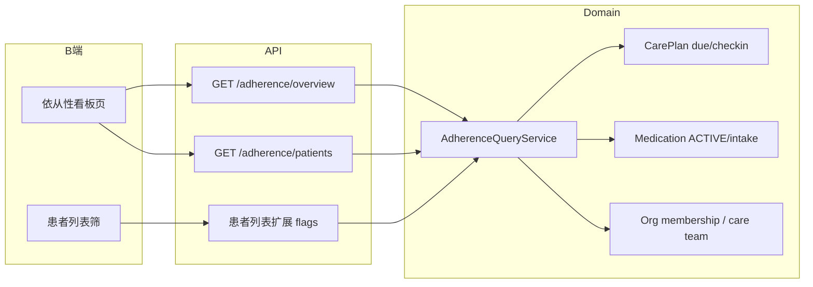

# 依从性看板：产品与技术方案

| 项 | 内容 |
|---|---|
| 版本 | **v0.2** |
| 日期 | 2026-09-07 |
| 状态 | **v0.2 早班默认看昨日 + 连续≥3** |
| 依据 | 健康管理闭环缺口分析；既有 `care_plan_task_checkin` / `people_medication_intake` |
| 入口 | B 端机构工作台 |
| 范围 | **方案任务打卡 + 用药依从**；侧栏主页 + 患者列表轻量筛 |
| 非目标（本期） | 推送催办、告警工单落库、随访记录、效果评估闭环 |

### Grill 已确认

| # | 结论 |
|---|---|
| Q1 | **合并看板**：方案打卡 + 用药依从 |
| Q2 | **侧栏主入口 + 患者列表轻量筛** |

---

## 1. 产品目标

### 1.1 一句话

让健管师每天打开工作台就能回答：**该先找谁、为什么、点进去做什么**（早班优先看昨日结果与连续缺口，而非催办「今天还没做完」）。

### 1.2 解决什么问题

| 现状 | 痛点 |
|------|------|
| 打卡/服药数据散落在患者详情 | 无法机构级批量发现「未执行」 |
| 只能人肉翻患者页 | 随访漏人、优先级靠感觉 |
| 有执行数据无运营面 | 半闭环停在「看得见」，到不了「跟得上」 |
| 默认看「今日未完成」 | 早高峰误催当日尚未到期的任务 |

### 1.3 成功标准（MVP）

1. 健管师 **30 秒内**看到待跟进名单与人数摘要；**默认统计日 = 昨天**，快捷筛默认 **连续≥3**  
2. 可按健管组筛选；可点进患者「管理方案 / 用药」继续处理  
3. 患者列表可用同一套规则做轻量筛选（当日方案未完成 / 当日用药未完成 / 连续≥3）  
4. 指标口径与 C 端打卡行为一致，避免「看板红、患者端绿」

---

## 2. 用户与场景

### 2.1 角色

| 角色 | 用法 |
|------|------|
| 健管师 | 早高峰看看板 → 电话/企微催办 → 进患者页核对 |
| 医生（同机构） | 偶发查看本组高风险患者 |
| 租户管理员 | 可看本机构全量（与现有患者权限一致） |

### 2.2 核心场景

```text
上班打开「依从性看板」（默认日期=昨天，默认筛=连续≥3）
  → 顶部：连续≥3 / 昨日方案未完成 / 昨日用药未完成 / 昨日待跟进
  → 可一键切「今天」看当日进度；可点卡片切换筛选
  → 列表按风险排序，筛「本组」
  → 点「张三」→ 患者详情（管理方案·执行打卡 / 用药）
  → 催办后刷新
```

备选路径：患者管理列表筛「当日方案未完成」→ 同一结果集的轻量入口。

---

## 3. 信息架构

### 3.1 导航

```text
机构工作台侧栏
  ├─ 患者管理          （已有；加依从性筛选项）
  ├─ 依从性看板        （默认落地「昨天」+ 筛「连续≥3」）
  ├─ 健管组
  └─ 成员管理
```

### 3.2 页面结构（侧栏主页）

```text
┌──────────────────────────────────────────────────────────┐
│ 依从性看板   日期[昨天▾] [昨天|今天]  健管组[全部▾]         │
├──────────────────────────────────────────────────────────┤
│ [连续≥3] [昨日方案未完成] [昨日用药未完成] [昨日待跟进]      │  ← 可点快捷筛
├──────────────────────────────────────────────────────────┤
│ 风险 | 姓名 | 健管组 | 昨日方案 | 昨日用药 | 连续未执行 | 近7日方案任务完成率 | 操作 │
└──────────────────────────────────────────────────────────┘
```

文案随所选日动态变为「昨日 / 今日 / 该日」。

### 3.3 患者列表轻量筛（不新开页）

在现有「患者管理」筛选区增加：

| 筛选项 | 含义 |
|--------|------|
| 当日方案未完成 | 有生效方案且查询日 due 任务存在未 DONE/SKIPPED |
| 当日用药未完成 | 有在用药品且查询日用药打卡未达标 |
| 连续未执行≥3天 | 方案维度连续日历日未达标（见口径） |

可与健管组、关键词组合。

---

## 4. 指标与口径（产品核心）

### 4.1 纳入人群（Universe）

机构 ACTIVE membership 患者，且满足任一：

- 查询日存在**执行中**管理方案（ACTIVE 且落在当前版本 horizon 内）；或  
- 存在 **ACTIVE** 在用药品  

二者皆无 → 不进看板（避免噪音）。

### 4.2 方案任务：应打 / 已打 / 未完成

复用现有 `CarePlanCheckinService.isDueOnDate` 与今日任务逻辑。

| 状态 | 定义 |
|------|------|
| 应打 `due` | 当日存在**执行中**方案（ACTIVE 且落在当前版本 `publishedAt` 起 `horizonDays` 天内），且频次命中、任务 enabled |
| 已完成 `done` | 打卡 `DONE` |
| 已跳过 `skipped` | 打卡 `SKIPPED`（**算已回应，不算完成**） |
| 未完成 `incomplete` | 无记录，或状态为 `MISSED`，或当日仍 `pending` |

**无执行中方案**：查询日不在当前版本执行窗口内（尚未到发布日 / 已过周期 / 无 ACTIVE 版本）时，视为当日无方案：`hasActivePlan=false`，列表展示「无方案」，不计方案未完成与连续未执行。仅有在用药时仍可进看板。

**当日完成率（方案）**

\[
\text{planDoneRate} = \frac{\text{done}}{\text{due}} \quad (\text{due}=0 \text{ 则视为 N/A，不因方案拖红})
\]

**当日是否「方案未完成」**：`due > 0 && (done + skipped) < due`  
（跳过全部应打任务 → 不算未完成，但完成率可为 0；列表可展示「已跳过」）

**历史日（date < today）**：无打卡记录的应打任务 **虚拟计为未完成**（等价 MISSED），不强制写库。

### 4.3 用药：应打 / 已打（MVP 简化）

现状：C 端首页多为「每药每日一次 OTHER 时段」打卡；`frequency` 有 QD/BID 等字典，但未强制拆时段。

**MVP 口径（与 C 端对齐，优先可解释）**

| 项 | 规则 |
|----|------|
| 应打药品种类 | 当日仍 ACTIVE 的药品（`start_date ≤ day`，且未停或 `stop_date ≥ day`） |
| 当日达标 | 该药在当日至少 1 条 `TAKEN` |
| 未完成 | 存在 ACTIVE 药且当日无 `TAKEN`（`MISSED`/`SKIPPED` 或无记录均算未达标；SKIPPED 单独展示） |
| 用药完成率 | `takenMedCount / activeMedCount` |

**P1.5（可选增强，不进本期）**：按 `frequency`（QD=1/BID=2/TID=3/QID=4）展开应打次数与默认时段。

### 4.4 连续未执行天数

仅统计 **方案维度**（用药连续未服作次要字段，本期可不进风险主排序）：

- 从 `date`（看板默认昨天）往前数日历日   
- 若该日 `due=0` → **跳过该日不打断连续**（无任务日不算「执行了」也不算「断了」）  
- 若该日 `due>0` 且未完成 → 连续 +1  
- 若该日已完成（`(done+skipped)≥due`）→ 连续中断  
- 最多回溯 30 天  

### 4.5 近 7 日方案任务完成率

最近 7 个日历日（含统计日）中，所有 `due` 任务合计：`Σdone / Σdue`；`Σdue=0` → N/A。看板列文案为「近7日方案任务完成率」。

**展示色阶**（列表：色字 + 迷你进度条；表头悬停看完整口径）：

| 完成率 | 色 | 含义 |
|--------|----|------|
| ≥ 80% | 绿 | 良好 |
| ≥ 60% | 蓝 | 尚可（中风险阈值之上） |
| ≥ 50% | 橙 | 偏低，需留意 |
| &lt; 50% | 红 | 较差 |
| 无应打 | 灰 | `-` |

列名简写为「近7日完成率」，完整名「近7日方案任务完成率」。

### 4.6 风险等级（排序用）

| 等级 | 条件（满足任一） |
|------|------------------|
| **高** | 查询日方案未完成 **或** 查询日用药未完成 **或** 连续未执行 ≥ 3 |
| **中** | 非高，且（近 7 日方案任务完成率 &lt; 60% 或 7 日有 due 且完成率空缺过多） |
| **低** | 纳入人群且不满足高/中 |

默认排序：高 → 中 → 低；同级内按「连续天数 desc → 查询日未完成任务数 desc → 姓名」。

### 4.7 顶部摘要卡

| 卡片（文案随所选日） | 计数 |
|------|------|
| 连续≥3天（默认选中） | 截至查询日连续未执行 ≥ 3 |
| 昨日/今日/该日方案未完成 | 查询日方案未完成人数 |
| 昨日/今日/该日用药未完成 | 查询日用药未完成人数 |
| 昨日/今日/该日待跟进 | 风险=高 的患者数 |

点击卡片 = 列表筛到对应条件；再点取消筛选。

---

## 5. 交互与权限

### 5.1 操作

| 操作 | 行为 |
|------|------|
| 详情 | 跳转 `/workspace/patients/:peopleId/care-plan`（query `tab=checkins`）或用药页；行内两个链接 |
| 刷新 | 手动刷新；进入页自动拉一次 |
| 日期 | **默认昨天**；快捷「昨天 / 今天」；可查任意历史日（历史日「未完成」含虚拟漏打） |
| 默认筛 | 进入页默认筛 `STREAK_GE_3`（早班聚焦连续缺口） |

### 5.2 本期不做

- 一键短信/推送催办  
- 在看板内代打卡（仍去患者详情）  
- 告警工单 / 随访记录落库  
- C 端展示机构排名  

### 5.3 权限

与现有机构患者列表一致：当前 `orgId` 下 ACTIVE membership；健管组筛复用现有 `careTeamId`。  
不另造数据权限模型。

---

## 6. 技术方案

### 6.1 总体策略



**MVP：在线聚合（read-time）**，不新增快照表。  
机构早期患者量通常可控；单次请求对「有方案或有药」的患者批量算当日 + 轻量 7 日/连续。

若单机构 ACTIVE 患者 &gt; 2000 且接口 &gt; 2s，再上 P1.5 日快照表（见 6.6）。

### 6.2 模块落点

| 层 | 建议 |
|----|------|
| Domain | `health-core` 新增 `com.healix.core.adherence`：`AdherenceQueryService` + DTO |
| 复用 | `CarePlanCheckinService` 的 due 判定（抽 package 可见方法或共享 `CarePlanDueSupport`） |
| Web | `health-app`：`BAdherenceController` |
| 患者列表 | `OrgWorkspaceService.listOrgPatients` 可选查询参数，或列表后再批量补 flags（推荐独立 adherence API，列表筛走 adherence 接口避免把患者列表拖慢） |
| 前端 | `AdherenceBoardView.vue`；`WorkspaceLayout` 菜单；`PatientsView` 筛选项；router |

### 6.3 API 设计

#### 6.3.1 看板摘要

`GET /api/b/v1/adherence/overview?date=&careTeamId=`

```json
{
  "date": "2026-09-05",
  "careTeamId": null,
  "universeCount": 86,
  "followUpCount": 12,
  "planIncompleteCount": 8,
  "medIncompleteCount": 7,
  "streakGe3Count": 3
}
```

#### 6.3.2 看板列表

`GET /api/b/v1/adherence/patients?date=&careTeamId=&risk=&filter=&keyword=&page=&size=`

`filter` 枚举：`FOLLOW_UP` | `PLAN_INCOMPLETE` | `MED_INCOMPLETE` | `STREAK_GE_3`（可空）

```json
{
  "total": 12,
  "items": [
    {
      "peopleId": "...",
      "displayName": "张三",
      "careTeamId": "...",
      "careTeamName": "慢病一组",
      "clientLinked": true,
      "riskLevel": "HIGH",
      "plan": {
        "hasActivePlan": true,
        "due": 4,
        "done": 1,
        "skipped": 0,
        "incomplete": 3,
        "todayIncomplete": true,
        "streakDays": 3,
        "rate7d": 0.45
      },
      "med": {
        "activeCount": 2,
        "takenCount": 0,
        "todayIncomplete": true
      }
    }
  ]
}
```

#### 6.3.3 患者列表轻量筛

推荐：**筛选项切换时改调** `GET /api/b/v1/adherence/patients`（只展示有问题的人），或  

`GET /api/b/v1/org/patients?adherenceFilter=PLAN_INCOMPLETE&date=`  

实现上后者内部委托 `AdherenceQueryService`，避免两套口径。

### 6.4 核心算法（伪代码）

```text
for people in orgPatients(careTeam?):
  planMetrics = calcPlan(people, date)   // due/done/skipped via isDueOnDate + checkins
  medMetrics  = calcMed(people, date)    // ACTIVE meds + TAKEN today
  if !planMetrics.inUniverse && !medMetrics.inUniverse: skip
  streak = calcPlanStreak(people, date)  // walk back ≤30d
  rate7d = calcPlanRate(people, date-6..date)
  risk = toRisk(planMetrics, medMetrics, streak, rate7d)
```

批量查询优化（一期就做）：

1. 一次拉机构患者 + 健管组  
2. 一次拉 ACTIVE care_plan / current version / tasks（按 people_id in (...)）  
3. 一次拉 date 与 [date-30, date] 的 checkin  
4. 一次拉 ACTIVE medications + 当日 intakes  

内存聚合，避免 N+1。

### 6.5 与现有代码的衔接点

| 现有 | 用法 |
|------|------|
| [`CarePlanCheckinService.isDueOnDate`](backend/health-core/src/main/java/com/healix/core/careplan/service/CarePlanCheckinService.java) | 抽到 `CarePlanDueSupport`，看板与今日待办共用 |
| `care_plan_task_checkin` | 事实表；历史无行 = 虚拟未完成 |
| `people_medication` / `people_medication_intake` | 用药维度 |
| `OrgWorkspaceService.listOrgPatients` | 人群与健管组 |
| C 首页打卡 | 口径对齐基准 |

### 6.6 P1.5 可选：日快照（本期不做）

表 `people_adherence_daily`：

- `people_id, date, plan_due, plan_done, plan_skipped, med_active, med_taken, streak_days, risk_level`  
- 每日凌晨批算昨日；今日仍实时  

仅当在线聚合性能不足时启用。

### 6.7 前端改造清单

| 文件 | 改动 |
|------|------|
| `WorkspaceLayout.vue` | 菜单增加「依从性看板」 |
| `router/index.ts` | `/workspace/adherence` |
| 新建 `AdherenceBoardView.vue` | 摘要卡 + 表格 + 筛 |
| `PatientsView.vue` | 增加依从性筛；结果可复用 adherence API |
| 患者详情深链 | `care-plan?mainTab=checkins`（若尚未支持 query 同步则补） |

---

## 7. 分阶段落地

### Phase 1（本期 MVP）— 建议 3～5 人日

1. Domain：`AdherenceQueryService` + due 抽取  
2. API：overview + patients  
3. 前端看板页 + 侧栏  
4. 患者列表两个筛：今日方案未完成 / 今日用药未完成  
5. 联调口径与 C 端今日数据一致  

### Phase 1.5

- 连续≥3 天筛与摘要卡强化  
- 用药按 frequency 展开应打次数  
- 深链 query 定位 tab  
- 性能：批量 SQL / 必要索引（`care_plan(tenant, status, people)` 等已有则复用）  

### Phase 2（运营闭环下一跳）

- 未完成 → 工作台催办 / 随访记录（见 `随访-产品与技术方案.md`）  
- 推送提醒  
- 日快照与机构趋势图  

---

## 8. 验收用例

| # | 用例 | 期望 |
|---|------|------|
| 1 | 患者今日 4 应打、完成 1 | 方案未完成=是；完成率 25% |
| 2 | 4 应打全 SKIPPED | 方案未完成=否；完成率 0%；不进「方案未完成」卡 |
| 3 | 无 ACTIVE 方案、有 2 药未 TAKEN | 仅用药未完成；进待跟进 |
| 4 | 昨日应打未打、查历史日 | 计未完成（虚拟） |
| 5 | 中间某日 due=0 | 不打断连续计数逻辑（跳过该日） |
| 6 | 健管组筛 | 人数与列表仅该组 |
| 7 | 患者列表筛方案未完成 | 与看板同口径 |

---

## 9. 风险与注意

| 风险 | 缓解 |
|------|------|
| 用药「每日一次」与 BID 真实医嘱不符 | MVP 明示口径；P1.5 按频次展开 |
| 未写 MISSED 行导致历史统计偏乐观 | 历史日虚拟未完成 |
| PRN 任务每日都 due | 沿用现有 isDueOnDate；后续可排除 PRN 出依从统计 |
| 在线聚合变慢 | 批量查询；超阈值阈值上快照 |
| 无 C 端关联患者永远红 | 看板展示 `clientLinked`；可筛「已激活」作后续增强 |

---

## 10. 决策摘要（实现冻结）

| 主题 | 冻结结论 |
|------|----------|
| 范围 | 方案 + 用药 |
| 入口 | 侧栏看板 + 患者列表筛 |
| 计算 | MVP 在线聚合 |
| 方案未完成 | due&gt;0 且 done+skipped &lt; due |
| 用药未完成 | 有 ACTIVE 药且当日无 TAKEN |
| 风险高 | 方案未完成 ∨ 用药未完成 ∨ 连续≥3 |
| 工单/推送 | 不做 |

---

## 11. 实现任务拆分（开发用）

1. 抽取 `CarePlanDueSupport`（`isDueOnDate` + slot 解析）  
2. `AdherenceQueryService` + Mapper 批量查询  
3. `BAdherenceController`  
4. `AdherenceBoardView` + 路由/菜单  
5. `PatientsView` 筛选项对接  
6. 自测验收用例 1～7  
