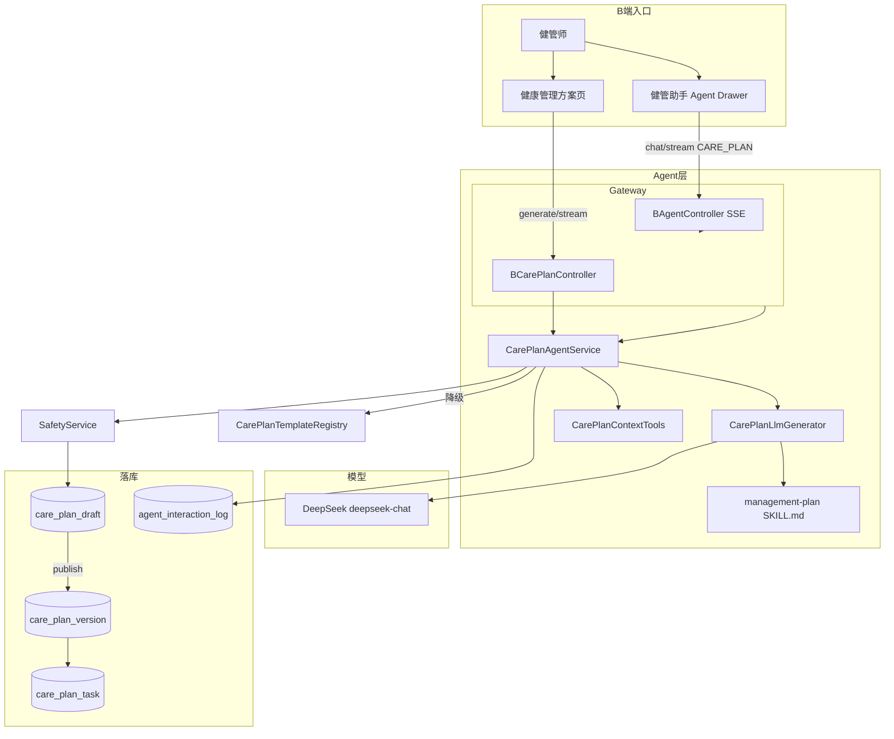

# 健康管理方案技术方案（Agent + Skills）

| 项 | 内容 |
|---|---|
| 版本 | **v1.1** |
| 日期 | 2026-08-31 |
| 状态 | **P1 已落地；P1.5（LLM + 流式 + 健管助手）已落地** |
| 依据 | `SaaS架构.md`、`患者档案-字典与元数据.md`、`患者观测数据-指标检验检查.md` |
| 范围 | B 端患者级管理方案：运动 / 饮食 / 执行计划；CARE_COPILOT 主智能体 + Skills；模板降级 + DeepSeek LLM |
| 阶段 | **P1** ✅ 模板编排 / 发布；**P1.5** ✅ LLM 接线 / SSE / 健管助手；**P2** 打卡 / C 只读 |

---

## Grill 决策摘要（仍有效 + 增量）

### 产品与责任

| # | 结论 |
|---|---|
| G1 | 发布前必须人工审阅；**P1.5 已接 LLM**，健管助手路径 **requireLlm=true**（失败报错，不静默降级模板） |
| G2 | 同一患者 **至多 1 个 ACTIVE** |
| G3 | **仅员工 publish** 可生效 |
| G4 | 健管干预建议；`care_plan_version` 预留签署列 |
| G5 | 上下文残缺仍可生成；`safetyFlags` + UI 告警 |

### 生命周期与存储

| # | 结论 |
|---|---|
| G6～G17 | 同 v1.0（draft / version / task 投影、单 draft、乐观锁等） |
| G18 | ERROR / WARN 规则不变 |
| G27 | B 端方案页：**「生成方案」**；健管助手：**「制定健康管理方案」**（走 LLM） |
| G29 | `source`：`TEMPLATE` / `MANUAL` / `TEMPLATE_THEN_EDIT` / **`LLM`** / `LLM_THEN_EDIT`；列表展示 **AI / 人工** |
| G30 | 丢弃草稿；列表支持删除草稿 / 非生效历史版本 |

### P1.5 增量决策

| # | 结论 |
|---|---|
| G31 | LLM：**DeepSeek**（Spring AI OpenAI 兼容，`api.deepseek.com`） |
| G32 | Skill 文档合并为 **`management-plan`**（运动/饮食/总结/执行）；编排仍经 `CarePlanAgentService` |
| G33 | 生成支持 **SSE 流式**：progress / tool / skill / token / result / done |
| G34 | 健管助手（Agent Drawer）与方案页 **共用** `CarePlanAgentService.generateStream` |
| G35 | 开发环境默认 **`dev` profile** + `application-local.yml` 配 API Key；`healix.agent.enabled=true` |
| G36 | 方案页双 TAB：**管理方案列表**（分页）+ **制定新的方案**（编辑区） |
| G37 | Agent 生成完成后可 **预览方案详情**（弹窗，只读） |

---

## 0. 产品定位

| 项 | 口径 |
|----|------|
| 主场景 | 健管师在患者详情生成、审阅、发布管理方案 |
| 内容三块 | 运动方案、饮食方案、执行计划 + **方案总结**（LLM JSON 含 `summary` / `goalSummary`） |
| 生成 | 主智能体 + `management-plan` Skill；**LLM 优先**，失败时方案页可降级模板，健管助手强制 LLM |
| 消费方 | 仅 B；C / 打卡 = P2 |
| Agent 隔离 | `CARE_COPILOT`（B 健管助手） vs C 端 `PATIENT` |



---

## 1. 领域与边界

| 模块 | 状态 |
|------|------|
| Care Plan 头 / Draft / Version / Task 投影 | ✅ |
| 运动 / 饮食 / 执行 Spec | ✅ |
| 模板四套 + LLM 结构化 JSON | ✅ |
| Safety ERROR/WARN + publish ack | ✅ |
| 方案列表分页 + 删除 | ✅ |
| 健管助手 SSE + 预览 | ✅ |
| 执行打卡 / C 只读 / 签署 UI | ❌ P2 |

档案 lifestyle、观测、用药 = **只读上下文**（`CarePlanContextService`），方案不写回档案。

---

## 2. B 端信息架构

顶栏：`患者档案 | 用药管理 | 健康数据 | **健康管理方案** | 修订历史`

**健康管理方案** 内两个主 TAB：

| TAB | 内容 |
|-----|------|
| **管理方案列表** | 分页表格：标题、制定方式（AI/人工）、版本、制定人、时间、状态；操作：详情、删除 |
| **制定新的方案** | 生成方案、新建空白草稿、保存/丢弃/发布；二级：总览 / 运动 / 饮食 / 执行 |

**健管助手**（患者详情右侧 Drawer）：

- 快捷能力：`CARE_PLAN` / `GENERAL_CHAT`
- 制定方案时展示：**进度时间线**（progress / tool / skill）、**AI 流式 JSON**、完成后 **预览方案详情** + **查看方案草稿**

路由：

- `/workspace/patients/:peopleId/care-plan`

---

## 3. Agent 架构

### 3.1 模块划分

| 模块 | 职责 |
|------|------|
| `StaffAgentGateway` | B 端对话路由：`CARE_PLAN` → `CarePlanAgentService`；其余 → `GeneralChatSkill` |
| `CarePlanAgentService` | 方案编排：加载上下文 → Skill → LLM/模板 → Safety → 落 draft |
| `CarePlanLlmGenerator` | 读 `management-plan` SKILL，调 `LlmClient.streamChat`，解析 JSON |
| `CarePlanTemplateRegistry` | LLM 不可用或方案页降级时的模板生成 |
| `LlmClient` | Spring AI `ChatModel` 封装；chat / streamChat |
| `CarePlanContextTools` | `@Tool` 包装 `CarePlanContextService.load` |

C 端聊天 **`HealthAgentService`** 与方案生成 **分离**；方案不经过 C 端 Agent。

### 3.2 Skill

路径：`health-agent/src/main/resources/skills/management-plan/SKILL.md`

输出严格 JSON（无 markdown 包裹）：

```json
{
  "summary": "阶段总结",
  "goalSummary": "一句话目标",
  "exercise": { },
  "diet": { },
  "execution": { }
}
```

职责：运动 / 饮食 / 执行 / 总结文案；Safety 与 publish 仍由 **业务服务** 负责。

### 3.3 Context Tools（加载时逐步 SSE 展示）

`CarePlanContextService.load(tenantId, peopleId, tracer)` 逐步回调：

| Tool 名 | 数据 |
|---------|------|
| `loadCarePlanContext` | 编排入口 |
| `PeopleBasicArchive` | 基础档案 / 现病史 |
| `PeopleDiseaseArchive` | 病种专病档案 |
| `peopleAllergens` | 过敏原 |
| `PeopleMedication` | 在用药 |
| `VitalRecord` | 最新体征 |
| `LabReport` | 近期检验 |

### 3.4 LLM 配置

| 配置项 | 说明 |
|--------|------|
| `spring.profiles.active` | 默认 `dev`（本地） |
| `healix.agent.enabled` | `dev` 下 `true` |
| `spring.ai.openai.api-key` | `application-local.yml`（gitignore） |
| `spring.ai.openai.base-url` | `https://api.deepseek.com` |
| `spring.ai.openai.chat.options.model` | `deepseek-chat` |

启动日志：`AgentLlmStartupLogger` 输出 `[Agent] startup llmEnabled=... apiKeyConfigured=...`

运行时日志：`[LLM]` / `[CarePlan]`（start / success / failed / 降级原因）

### 3.5 生成路径差异

| 入口 | LLM | 失败行为 |
|------|-----|----------|
| 健管助手 `CARE_PLAN` | 必须 | `BusinessException`，SSE error 事件 |
| 方案页「生成方案」 | 优先 | 降级 `CarePlanTemplateRegistry`，`source=TEMPLATE` |

### 3.6 SSE 事件协议

统一 envelope：`{ "type": "...", "data": { ... } }`

| type | 用途 |
|------|------|
| `progress` | 阶段文案 |
| `tool` | `{ name, status, detail }` |
| `skill` | `{ name, detail }` |
| `token` | LLM 流式文本 |
| `result` | 最终 payload（Agent 为 `AgentResponse`；方案页为 `CarePlanBundleDto`） |
| `error` / `done` | 结束 |

实现要点：

- 后端 `AgentSseSupport`：`no-cache`、`flushBuffer`、连接 comment 心跳
- 前端 dev 直连 `http://127.0.0.1:8080` 避免 Vite 代理缓冲 SSE
- `JsonUtils` 注册 `JavaTimeModule`（`LocalDateTime` 序列化）

### 3.7 Safety（不变）

| 级别 | Code | 行为 |
|------|------|------|
| ERROR | `DIET_ALLERGEN_CONFLICT` | 不可 publish |
| ERROR | Schema / 最低非空 | 不可 publish |
| WARN | `CONTEXT_INCOMPLETE` / `NO_DISEASE_TAG` / `HYPOGLYCEMIA_RISK` | ack 后可发 |

---

## 4. 数据模型

与 v1.0 一致，补充：

- 列表行来源：**当前 draft**（`recordType=DRAFT`）+ **全部 `care_plan_version`**
- 列表 `sourceMode`：`LLM` → **AI**；其余 → **人工**
- 版本状态：当前 `current_version_id` → **ACTIVE**；其余 → **ARCHIVED**
- 删除：草稿 soft delete；历史版本 soft delete（**不可删当前生效版**）

---

## 5. API（B）

包：`com.healix.web.b.careplan`、`com.healix.web.b.agent`

### 5.1 方案 CRUD / 生命周期

| 方法 | 路径 | 说明 |
|------|------|------|
| GET | `/patients/{peopleId}/care-plan` | 头 + ACTIVE + draft |
| GET | `/patients/{peopleId}/care-plan/items?page&pageSize` | **方案列表（分页）** |
| DELETE | `/patients/{peopleId}/care-plan/items/{itemId}?recordType=DRAFT\|VERSION` | 删除列表项 |
| POST | `/patients/{peopleId}/care-plan/draft` | 手工空草稿 |
| POST | `/patients/{peopleId}/care-plan/generate` | 同步生成（可模板降级） |
| POST | `/patients/{peopleId}/care-plan/generate/stream` | **SSE 流式生成** |
| PUT | `/patients/{peopleId}/care-plan/draft` | 编辑；乐观锁 `version` |
| DELETE | `/patients/{peopleId}/care-plan/draft` | 丢弃草稿 |
| POST | `/patients/{peopleId}/care-plan/publish` | 发布 + 投影 tasks |
| POST | `/patients/{peopleId}/care-plan/edit` | 基于 ACTIVE clone draft |
| GET | `/patients/{peopleId}/care-plan/versions` | 历史版本 ID 列表 |
| GET | `/patients/{peopleId}/care-plan/versions/{versionId}` | 版本详情 |

### 5.2 健管助手（Agent）

| 方法 | 路径 | 说明 |
|------|------|------|
| GET | `/agent/capabilities` | 能力列表 |
| POST | `/agent/chat` | 同步对话 |
| POST | `/agent/chat/stream` | **SSE 对话/制定方案** |

`AgentResponse` 流式 result **不含**完整 `extracted`（避免 SSE 过大）；日志 `toolCallsJson` 仅存 planId/draftId 摘要。

---

## 6. 前端（B）

| 组件 | 路径 | 说明 |
|------|------|------|
| `PatientCarePlanView.vue` | 方案页双 TAB + 编辑表单 | |
| `AgentDrawer.vue` | 健管助手 | 挂载于 `PatientDetailLayout` |
| `CarePlanPreviewDialog.vue` | 方案只读预览 | 列表详情 / Agent 预览共用 |
| `agent-stream.ts` | SSE 客户端 | progress/tool/skill/token/result |

---

## 7. 修订与审计

- `bizType=CARE_PLAN`：生成 / 发布 / 丢弃 / 编辑
- `agent_interaction_log`：`CARE_PLAN_GENERATE` intent；`draft_reply=LLM|TEMPLATE|TEMPLATE_FALLBACK`

---

## 8. 实现状态

| 步骤 | 状态 |
|------|------|
| Schema + SchemaEnsure | ✅ |
| CarePlanService（draft/publish/投影/修订） | ✅ |
| CarePlanAgentService + 模板 + LLM | ✅ |
| management-plan SKILL | ✅ |
| B API + SSE | ✅ |
| 方案页 + 列表分页 | ✅ |
| 健管助手 + 流式 + 预览 | ✅ |
| DeepSeek 本地配置 + 启动/运行日志 | ✅ |
| P2 打卡 / C 只读 | ⬜ |

---

## 9. 非目标（当前）

- C 端方案只读 / 打卡回写  
- 随访工单自动创建  
- OCR 报告入方案（Skill 预留，UI 未开）  
- 异步 Job 队列  
- 医学签署 UI  
- 多 ACTIVE、PATIENT Agent 写方案  

---

## 10. 原则

1. **人机闭环**：仅 publish 生效  
2. **编辑真相**：draft JSON；`care_plan_task` = 发布投影  
3. **可降级**：方案页无 LLM 仍可用模板；健管助手方案能力要求 LLM  
4. **可观测**：SSE 时间线 + `[LLM]`/`[CarePlan]` 日志 + interaction_log  
5. **租户患者归属**；org 仅审计  

---

## 11. 本地开发

```bash
# 后端（dev profile 默认开启 agent）
cd backend && mvn -pl health-app -am spring-boot:run

# 配置 DeepSeek Key：health-app/src/main/resources/application-local.yml（勿提交）
# spring.ai.openai.api-key: sk-...

# 前端
./scripts/start-dev.sh   # 仅启动 5174；SSE dev 直连 8080
```

验证：

1. 启动日志 `[Agent] llmEnabled=true apiKeyConfigured=true`  
2. 健管助手制定方案 → 时间线含 Tool/Skill/DeepSeek 流式 → **生成方式：AI 生成**  
3. 方案页「管理方案列表」可见草稿/历史版本  

---

**文档版本 v1.1** — 反映 P1.5 已交付能力；P2 待规划。
