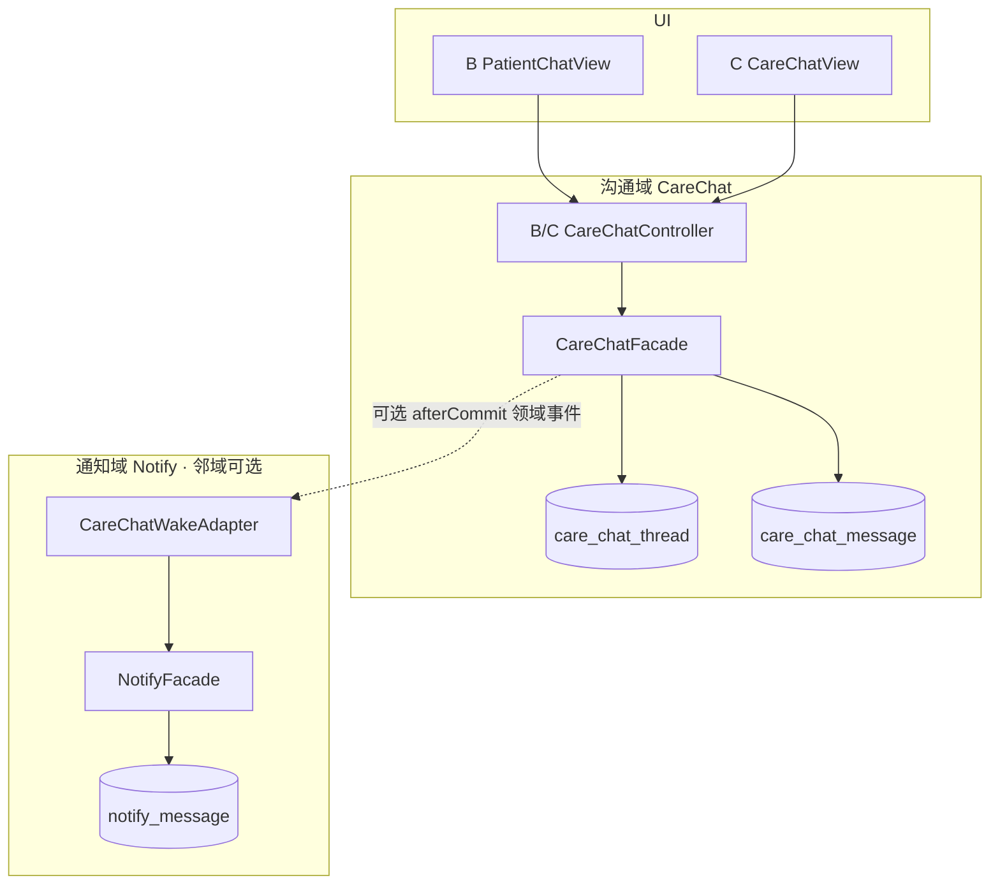

# 健管师与患者消息及时触达：产品与技术方案

| 项 | 内容 |
|---|---|
| 版本 | **v0.2** |
| 日期 | 2026-09-11 |
| 状态 | **草案（可 Grill）** |
| 领域口径 | **沟通（Conversation）与通知（Notification）分属两个限界上下文**；本方案只建沟通域 |
| 基建口径 | **V1 不引入商业 IM、不引入 MQ**；会话落 MySQL；实时用轮询（P1 可 SSE） |
| 依据 | `C端患者激活与账号绑定.md`；`机构工作台-健管组与患者建档.md`；`SaaS架构.md`；对照阅读 `消息中心-产品与技术方案.md`（邻域，非本域） |
| 入口 | B：患者详情「沟通」/ 工作台沟通未读；C：**独立「沟通」入口**（勿塞进系统通知列表） |
| 范围 | **健管师 ↔ 患者（就诊人）双向会话**；正文/未读/已读归属沟通域 |
| 非目标（本期） | 全量 IM；把聊天建成通知子类型；营销群发；跨租户；替代随访工单 |

### 领域边界（必须先分清）

| 限界上下文 | 已有/新建 | 方向 | 聚合根 | 用户心智 |
|------------|-----------|------|--------|----------|
| **通知 Notification** | 已有消息中心 | 系统 → 账号（多为单向） | `notify_message` + delivery | 「系统提醒我一件事」 |
| **沟通 Conversation** | **本方案新建** | 人 ↔ 人（机构语境） | `care_chat_thread` + messages | 「我和健管师在聊天」 |

```text
❌ 错误：在 notify_* 上扩展「可回复通知」冒充聊天
❌ 错误：C 端把会话气泡和系统通知混在同一个列表模型里
✅ 正确：沟通域自洽（发/收/未读/历史）；通知域最多做「唤醒」适配（可选）
```

| 关系 | 口径 |
|------|------|
| 领域模型 | **不共享**。会话不是 `eventType`，气泡不是 `notify_delivery` |
| 代码包 | `carechat/` 与 `notify/` **并列**；沟通 Facade **不**继承 Notify 模型 |
| 产品 UI | C：**「系统通知」与「健康沟通」分入口**；B：患者详情 Tab「沟通」，不是消息中心 |
| 下游适配（可选） | 仅当需要「人不在会话页时叫醒」时，沟通域 **发布领域事件** → 适配器调用 `NotifyFacade` 写一条「你有新沟通」；**失败不影响消息已发送** |
| `StaffNudge` | 仍属 **通知域**（依从提醒）；可从沟通页链过去，**不是**会话气泡 |

### 命名边界

| 概念 | 说明 |
|------|------|
| **会话 Thread** | 某租户下「机构视角的健管侧」与某 `people_id` 的一条沟通线程（MVP 一患者一线程/机构） |
| **消息 Message（会话）** | 线程内一条气泡（健管或患者发出）——**不是**通知 Message |
| **未读（沟通）** | 线程上的 `staff_unread_count` / `patient_unread_count`；**不以**通知已读代替 |
| **唤醒（可选）** | 邻域通知：「有新沟通，点进会话」；可关、可延后，不参与聊天正确性 |
| **工作台催办** | 任务/红人跟进；可链到会话，但不是会话本身 |

---

## 0. 定稿口径（建议 Grill）

### 0.1 产品与效力

| # | 建议结论 |
|---|----------|
| G1 | 成功标准 = **沟通域闭环**：B↔C 能发能回，**会话未读**正确；不以通知列表是否出现为准 |
| G2 | 定位 = 健康管理沟通辅助；**非诊疗处方通道**；敏感医疗建议仍走病历/随访正式流程 |
| G3 | V1 仅 **一对一（员工 ↔ 就诊人）**；不支持患者点对点找任意员工社交（回复落入所属机构会话） |
| G4 | 「及时」V1 = **打开沟通页拉取 + 短轮询**；沟通角标；**不依赖**通知中心刷新 |
| G4a | **V1 不引入商业 IM、不引入 MQ**；见 §3.3 |
| G4b | **沟通 ≠ 通知**：禁止把会话建在 `notify_*` 上；禁止用通知已读替代会话已读 |
| G5 | 无 C 绑定账号 → 不可发会话（可提示走电话/激活） |

### 0.2 参与者与权限

| # | 建议结论 |
|---|----------|
| G6 | 患者侧身份 = 绑定该 `people_id` 的 **`people_account`**（家属账号可代收/代回，文案带就诊人姓名） |
| G7 | 健管侧身份 = 当前工作台机构下可访问该患者的 **staff**（健管/医生/租户管理员，同现有档案鉴权） |
| G8 | 会话归属：`tenant_id + org_id + people_id`（机构内一条）；换机构另开或只读策略二期再定 |
| G9 | 消息不可物理删除（软删仅风控）；用户侧可「撤回」限时（如 2 分钟）可选 P1 |

### 0.3 唤醒适配（可选，邻域）

| # | 建议结论 |
|---|----------|
| G10 | 发送成功以 **会话落库** 为准；唤醒通知 **可选**、失败不回滚消息 |
| G11 | 若接唤醒：适配器发 `CARE_CHAT_WAKE_*` 到通知域；`dedupe` 防刷；**正文仍只在会话表** |
| G12 | 免打扰只约束 **外推唤醒**；会话与沟通角标照常更新 |
| G13 | 内容审核：禁止处方剂量自动结构化；正文长度上限；敏感词可后挂 |

### 0.4 分期

| 阶段 | 内容 |
|------|------|
| **V1** | 沟通域表 + B/C API + UI + **会话未读**；**可不接** Notify |
| **P1** | 可选唤醒适配（IN_APP / SMS / 订阅）；SSE；撤回 |
| **P2** | 已读回执精细化；模板话术；会话转随访工单；多媒体 |

---

## 1. 产品目标

### 1.1 一句话

在机构语境下建立 **健管师 ↔ 患者沟通域**（双向、可留痕、可未读），与系统通知域解耦。

### 1.2 成功标准（V1）

1. B 在患者详情「沟通」发送 → C 沟通页可见气泡 + **会话未读**。  
2. C 回复 → B 沟通入口未读 +1。  
3. 未绑定 C 账号 → 明确失败，不落幽灵会话。  
4. 历史分页；权限同档案访问。  
5. **不依赖**通知中心列表也能完成收发与未读；唤醒若接，仅为增强。

### 1.3 典型场景

| 角色 | 场景 |
|------|------|
| 健管师 | 「血压连续偏高，请今日复测并打卡」；患者问方案时间 → 回复确认 |
| 患者/家属 | 「药吃完了怎么买」；「随访改期」 |
| 医生（同权） | 查看线程并回复 |

```text
B 患者详情 → 沟通 Tab
  → CareChatFacade.send（事务内只写 thread/message/unread）
  → （可选）afterCommit → WakeAdapter → Notify「有新沟通」
  → C 打开「健康沟通」拉消息 / 回消息
  → 只更新会话未读（V1）；不必写 STAFF 通知
```

---

## 2. 信息架构

### 2.1 B 端

```text
工作台
  ├─ （可选）沟通未读汇总入口
  └─ 患者详情
        └─ Tab「沟通」  ← 会话时间线 + 输入框
```

### 2.2 C 端

```text
C App
  ├─ 系统通知（通知域 · 已有）     ← 报告发布、打卡提醒、Nudge…
  └─ 健康沟通（沟通域 · 本方案）   ← 会话列表 / 会话详情
```

> **禁止**把会话行渲染进系统通知同一数据源。深链可以是：通知「有新沟通」→ 打开沟通页（邻域跳转）。

路由建议：

| 端 | 路径 |
|----|------|
| B | `/workspace/patients/:peopleId/chat` |
| C | `/care-chat`（列表）+ `/care-chat/:threadId` |

---

## 3. 总体架构



### 3.1 职责

| 层 | 职责 |
|----|------|
| **CareChatFacade** | 建线程、发消息、列历史、标已读、会话未读、鉴权——**沟通正确性只在这里** |
| **CareChatWakeAdapter** | （可选）把「有新消息」翻译成通知命令；**不属于沟通聚合** |
| **NotifyFacade** | 邻域：系统通知与通道投递；**不存会话正文** |
| 前端 | 沟通页拉取/轮询；角标读会话 API，不读通知未读数冒充 |

### 3.2 为何绝不能把会话塞进 `notify_message`

| 维度 | 通知 | 沟通 |
|------|------|------|
| 语义 | 事件告知 | 多轮对话 |
| 幂等 | `dedupe_key` 合并 | 每条气泡独立 INSERT |
| 已读 | 收件人读完一条通知 | 线程游标 / 未读计数 |
| 方向 | 多为系统→人 | 人↔人 |
| 演进 | 通道、模板、免打扰 | 撤回、附件、转工单 |

混域代价：通知表被聊天撑爆、已读语义打架、产品心智混乱。

### 3.3 为何 V1 不引入商业 IM、不引入 MQ

| 选项 | V1 结论 | 理由 |
|------|---------|------|
| **商业 IM** | **不上** | 要的是机构内可审计沟通，不是通用 IM；权限/PHI 仍要自建 |
| **MQ** | **不上** | 人工会话量级小；与现有同步写库风格一致 |
| **自建沟通域** | **采用** | 两表 + Facade 即可闭环 |
| **WebSocket 集群** | **V1 不上** | 轮询足够；P1 可 SSE |
| **接 Notify 唤醒** | **可选** | 增强「人不在 App 时」；**不是**领域依赖 |

**「及时」V1**：进沟通页能看到新消息 + 角标；分钟级可接受。

**何时再考虑 IM / MQ**：同前版门槛（扇出拖垮、秒达、音视频等）——且 **仍保持沟通聚合在自建表**。

**反模式**：为聊天去「复用/扩展消息中心领域模型」；或为像 IM 先上中间件。

---

## 4. 数据模型

### 4.1 `care_chat_thread`

| 列 | 说明 |
|----|------|
| id / tenant_id / org_id / people_id | **机构 + 就诊人** 唯一会话 |
| last_message_at / last_message_preview | 列表用 |
| last_sender_type | `STAFF` \| `PATIENT` |
| staff_unread_count / patient_unread_count | 冗余计数（发送时 +1，已读清零） |
| closed_at | 可空；关闭后只读 |
| 软删三件套 | 项目惯例 |

**UK**：`(tenant_id, org_id, people_id)`（未删除）。

### 4.2 `care_chat_message`

| 列 | 说明 |
|----|------|
| id / tenant_id / thread_id | |
| sender_type | `STAFF` \| `PATIENT` |
| sender_staff_id | 健管侧必填 |
| sender_account_id | 患者侧 `people_account.id` |
| content_type | V1 仅 `TEXT`；P2 `IMAGE` |
| content | 文本，限长如 2000 |
| client_msg_id | 可选，客户端防重 |
| recalled_at | P1 |
| 软删三件套 | |

> **不**在消息行上强绑 `notify_message_id`（避免沟通聚合依赖通知主键）。唤醒若需要关联，放适配器侧日志/审计即可。

**索引**：`(thread_id, gmt_created DESC)`；`(tenant_id, sender_staff_id, gmt_created)`。

### 4.3 已读（V1 简化）

- **患者侧已读**：该账号打开线程 → 清 `patient_unread_count`，写 `care_chat_thread_read(account_id, thread_id, last_read_message_id)`。  
- **健管侧已读**：任一有权限员工打开 → 清 `staff_unread_count`（机构共享未读；P1 可改成按员工）。

V1 不做「每条消息已读回执勾」。

---

## 5. 唤醒适配（可选 · 邻域，非沟通核心）

V1 **可以不做本节**；仅会话未读 + 进页拉取即可验收。

若产品要「不在沟通页时被叫醒」，再加 **CareChatWakeAdapter**（防腐层）：

| 方向 | 通知 event（示例） | 文案 | 深链 |
|------|-------------------|------|------|
| → C | `CARE_CHAT_WAKE_C` | 「健管师有新沟通」 | `/care-chat/{threadId}` |
| → Staff | `CARE_CHAT_WAKE_STAFF` | 「患者回复了沟通」 | `/workspace/patients/{peopleId}/chat` |

约束：

1. 适配器 **只读**沟通侧事件（messageId/threadId），**不回写**会话表。  
2. body 不写具体血压/诊断数值。  
3. `dedupe_key` 按线程+分钟防刷（通知域自己的幂等）。  
4. 发送失败只打日志；**会话已成功**。  
5. V1 患者回复：**优先只靠 B 会话角标**；STAFF 唤醒通知可 P1。

通道：先 IN_APP；SMS / 订阅属通知域通道扩展，沟通域无感。

---

## 6. API

### 6.1 B 端

| 方法 | 路径 | 说明 |
|------|------|------|
| GET | `/api/b/v1/patients/{peopleId}/care-chat` | 取或创建线程 + 最近消息 |
| GET | `/api/b/v1/patients/{peopleId}/care-chat/messages?before&limit` | 历史分页 |
| POST | `/api/b/v1/patients/{peopleId}/care-chat/messages` | 发送 `{ content, clientMsgId? }` |
| POST | `/api/b/v1/patients/{peopleId}/care-chat/read` | 健管侧已读 |

鉴权：同档案 `assertStaffCanAccessPeople`。

### 6.2 C 端

| 方法 | 路径 | 说明 |
|------|------|------|
| GET | `/api/c/v1/care-chat/threads` | 我的会话列表（按绑定 people） |
| GET | `/api/c/v1/care-chat/threads/{id}/messages` | 历史 |
| POST | `/api/c/v1/care-chat/threads/{id}/messages` | 回复 |
| POST | `/api/c/v1/care-chat/threads/{id}/read` | 已读 |

鉴权：当前账号必须绑定该线程 `people_id`。

---

## 7. 实时性

| 阶段 | 方案 |
|------|------|
| V1 | 打开沟通页拉取；前台 10–15s 轮询 `afterId`；**角标来自会话 API** |
| P1 | SSE 推新消息（仍在沟通域）；可选唤醒通知 |
| P2 | 厂商推送等（经通知域通道，若需要） |

不在 V1 上 WebSocket 集群。

---

## 8. 前端要点

### 8.1 B `PatientChatView`

- 时间线气泡；输入发送；发送人姓名  
- 未绑定 C 禁用并引导激活  
- Tab「沟通」；未读角标读 **care-chat**，不读通知未读

### 8.2 C

- 独立「健康沟通」入口（会话列表/详情）  
- 与「系统通知」并列，**不同页面、不同 API**

### 8.3 合规文案（底栏固定）

> 沟通内容仅供健康管理联络，不构成诊断或处方；紧急情况请拨打当地急救电话或线下就诊。

---

## 9. 安全与合规

1. **租户 / 机构 / 患者访问**三重校验。  
2. 正文与日志脱敏。  
3. 审计：`CARE_CHAT_SEND`（沟通域）。  
4. 保留期后续与合规统一订。  
5. 家属代回：UI 标明「由家属账号发送」。

---

## 10. 与邻域接缝

| 邻域/现有 | 关系 |
|-----------|------|
| `notify/` / `NotifyFacade` | **可选**唤醒适配；非沟通聚合依赖 |
| `StaffNudgeService` | 通知域；沟通页可链「提醒打卡」，**不写进会话气泡** |
| `ArchiveAccessService` | B 鉴权复用 |
| `account_patient` | C 鉴权复用 |
| C 通知 UI | **保持独立**；不混会话 |

```text
health-core/.../carechat/          ← 沟通限界上下文
  domain, mapper, CareChatFacade
  wake/CareChatWakeAdapter         ← 可选，单向依赖 notify
health-app/.../web/b|c/carechat/
frontend-admin/.../PatientChatView.vue
frontend-user/.../CareChat*.vue    ← 勿塞进 NotificationsView 数据流
```

---

## 11. 实施计划

| 阶段 | 内容 |
|------|------|
| P0 | Grill：领域分界 + 开放问题 |
| P1 | `care_chat_thread` / `care_chat_message` |
| P2 | B/C API + 会话未读/已读 |
| P3 | B/C 沟通 UI |
| P4 | 审计 + 验收（**不强制** Notify） |
| P1+ | WakeAdapter、外推、SSE、撤回、图片 |

---

## 12. 验收（V1）

| # | 期望 |
|---|------|
| 1 | 无 C 绑定 → 发送失败，原因明确 |
| 2 | B 发送 → 会话表有 message；C **沟通 API** 可见（不要求出现在通知列表） |
| 3 | C 回复 → B **会话**未读 +1；打开沟通 Tab 清零 |
| 4 | 无档案权限 → 403 |
| 5 | 关闭 WakeAdapter 时，1–4 仍全部通过 |
| 6 | 系统通知列表 **不出现**会话气泡正文 |

---

## 13. 风险

| 风险 | 缓解 |
|------|------|
| 产品把聊天做成「可回复通知」 | G4b + UI 分入口 + 验收 #6 |
| 当成线上诊室 | 固定免责 |
| 及时性不足 | 轮询 + 角标；P1 SSE / 可选唤醒 |
| 误把 Nudge 当聊天 | 文案与入口分离 |

---

## 14. 开放问题（待 Grill）

| 问题 | 选项 |
|------|------|
| 家属账号是否都能回复 | A 全部绑定账号 / B 仅主账号 |
| V1 是否接 WakeAdapter | A **不接**（推荐先闭环）/ B 仅 C 侧 IN_APP 唤醒 |
| 一患者多机构 | A 每机构一线程（推荐）/ B 租户级单线程 |
| Tab / 入口名 | 「沟通」vs「健康沟通」 |
| 健管群发 | **V1 不做** |

---

## 15. 参考

1. `docs/消息中心-产品与技术方案.md` — **邻域**通知（对照，勿合并模型）  
2. `StaffNudgeService` — 通知域一键提醒  
3. `docs/C端患者激活与账号绑定.md` — 账号前提  
