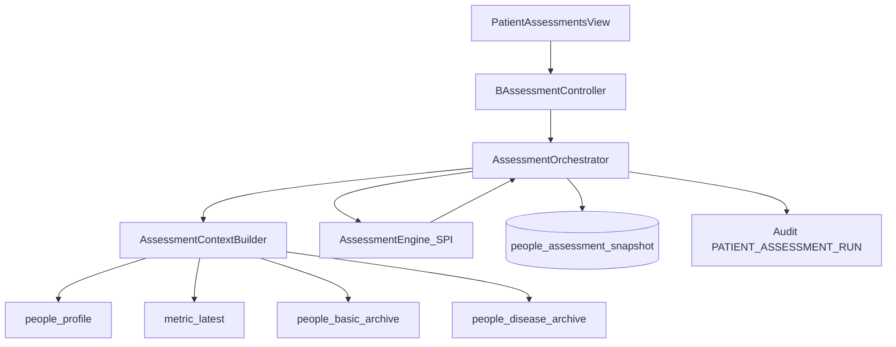

# 疾病风险等级与疾病分层评估：产品与技术方案

| 项 | 内容 |
|---|---|
| 版本 | **v0.3** |
| 日期 | 2026-09-11 |
| 状态 | **V1 已落地（CDRS + 肥胖筛查）+ China-PAR 官方结果录入 + 另列高危提示** |
| 依据 | 《中国2型糖尿病防治指南（2020）》CDRS；《肥胖症诊疗指南（2024）》BMI/腰围；China-PAR / PREVENT / 疾病分层作二期 |
| 入口 | B 端患者详情 Tab「疾病评估」 |
| 范围 | **疾病风险等级评估**：CDRS + 肥胖筛查 + China-PAR 录入；快照落库；历史可查；规则版本化；审计 |
| 非目标（本期） | 疾病分层评估（糖/高/肥胖）、PREVENT 本地公式、C 端、驾驶舱批量出分、自动开随访、定时批跑实现 |

### 命名边界

| 概念 | 库内编码 | 说明 |
|------|----------|------|
| **疾病风险等级评估** | `INCIDENT_RISK` | 尚未确诊该病时，按公开指南做发病风险分层（筛查向）；**非诊断** |
| **疾病分层评估** | `SEVERITY` | 已确诊后按公开指南做**管理分层**（管理向）；**非临床诊断分期**；V1 不上线 |
| 依从性「风险」 | — | 看板红人 / 连续未打卡，**不是**本模块 |
| 病种档案 | — | 确诊事实来源；本模块**不替代**病种档案 |

> 对外文案统一使用「疾病风险等级评估 / 疾病分层评估」；库字段 `kind` 仍用 `INCIDENT_RISK` / `SEVERITY` 保持兼容，API 另回 `kindLabel`。

### 变更摘要（v0.2 → v0.3）

| 点 | v0.2 | v0.3 |
|----|------|------|
| 术语 | 患病风险 / 确诊严重度 | **疾病风险等级评估 / 疾病分层评估** |
| 合规文案 | 短免责 | **强化免责**（非诊断、非治疗决策、指南版本可见） |
| China-PAR | 二期公式 | **官方结果录入**（本地无系数） |
| CDRS | 计分 | 计分 + **另列高危命中提示**（不改等级） |

### 变更摘要（v0.1 → v0.2 / Grill）

| 点 | v0.1 | v0.2 |
|----|------|------|
| V1 引擎 | CDRS + 肥胖筛查 + 三类严重度 | **仅 CDRS + `OBESITY_SCREEN`** |
| 确诊判定 | 病种或现病史 | **仅病种档案**；现病史最多提示建档 |
| 肥胖严重度 | 与筛查拆开同期 | **延后**（无肥胖病种档案） |
| 快照机构 | `org_id` 必有 | **不落 org**；跟人走；Job 触发可无机构 |
| 触发 | 偏手动 | 人工手动写库；**Job 表结构预留、本期不实现** |
| 历史 | 可选/仅最新 | **要做**：最新 + 历史抽屉/子页 |
| 过期指标 | 可标 stale 天数 | **只展示测量时间**，不设过期魔法数 |
| 审计 | 可选 | **必做** `PATIENT_ASSESSMENT_RUN` |

---

## 0. Grill 定稿口径

### 0.1 产品与效力

| # | 结论 |
|---|---|
| G1 | 成功标准 = **可解释结构化结论**（等级+分项）为主，**审计留痕**必带 |
| G2 | 动作闭环（高危→自动随访等）**二期** |
| G3 | 效力 = 健管师与医生**共用工作语言**，可写进管理备注/随访；**非诊断、非治疗决策**；C 端可见不绑架 V1 |
| G4 | Tab 名「疾病评估」；V1 **只展示疾病风险等级评估区**，不出现疾病分层空壳 |

### 0.2 引擎与适用

| # | 结论 |
|---|---|
| G5 | V1 引擎：`CDRS`、`OBESITY_SCREEN`（+ China-PAR 官方结果录入） |
| G6 | 存在病种档案 `diseaseCode=diabetes` → CDRS **不适用**（隐藏）+ UI 提示已建糖档 |
| G7 | CDRS 年龄：**20–74** 以外 → `applicable=false`（不硬打分） |
| G8 | `OBESITY_SCREEN`：可访问患者**一律可跑**；缺身高/体重等则 `INCOMPLETE` |
| G9 | 家族史：仅 `familyHistoryItems` 中 **`kinshipLevel=1` 且含 `FH_DIABETES`**；**`familyHistoryStatus=none` 或空数组 = 已确认无家族史（0 分）**；未写 status 且无 items = 未采集 |
| G10 | 家族史未采 / 缺性别 / 缺生日（致无法算年龄）→ **INCOMPLETE**，不编造 0 分 |
| G11 | CDRS 等级：&lt;15 `LOW` / 15–24 `MID` / ≥25 `HIGH`（HIGH 建议 OGTT） |
| G12 | 疾病分层评估（含肥胖 / 糖 / 高）整体二期；肥胖病种档案为肥胖分层前置；文案用「管理分层」不用「确诊分期」 |

### 0.3 数据、触发与权限

| # | 结论 |
|---|---|
| G13 | 快照按 **`tenant_id + people_id`** 聚合；**无 `org_id` 列**（批跑无机构） |
| G14 | 写入：`trigger_source` = `MANUAL` | `JOB`；`assessed_by_staff_id` 人工必填、Job 可空 |
| G15 | V1 **不实现**定时批跑；只预留字段。打开 Tab **不**自动写库 |
| G16 | 每次评估 **INSERT** 新快照；保留全历史 |
| G17 | UI：各引擎**最新结果卡** + **评估历史**（抽屉或子页，可筛引擎） |
| G18 | 能进该患者详情者均可 run（健管 / 医生 / 租户管理员） |
| G19 | 指标只展示**测量时间**，不设「N 天过期」阻断或徽章阈值 |
| G20 | 必做审计 `PATIENT_ASSESSMENT_RUN`（含 trigger_source、engines、peopleId、staff 可空） |
| G21 | 固定免责：基于公开指南的健康管理辅助信息；**不构成诊断或治疗建议**；不替代执业医师判断；展示指南名与 `rule_pack_version` |

---

## 1. 产品目标

### 1.1 一句话

在患者详情给出**可解释、可复算（或可留痕）、可审计**的疾病风险等级评估结论（糖尿病发病风险 + 肥胖/中心性肥胖筛查 + China-PAR 官方结果录入）。

### 1.2 成功标准（V1）

1. 一点「评估」跑适用引擎，见等级 + 分项 + 指南版本  
2. 缺关键输入 → `INCOMPLETE` + 缺项与补录入口，不假完整分  
3. 快照可查历史；展示 `rule_pack_version`  
4. 免责文案固定可见  
5. 对外口径始终为健康管理辅助，而非诊断/治疗决策  

---

## 2. 用户与场景

| 角色 | 用法 |
|------|------|
| 健管师 | 补齐指标/家族史 → 评估 → 解释 → 人工安排 OGTT/随访 |
| 医生 | 同权查看与评估 |
| 租户管理员 | 同机构可访问患者即可 |

```text
患者详情 → Tab「疾病评估」
  → CDRS（无 diabetes 病种且年龄 20–74）
  → 肥胖筛查（始终可点）
  → China-PAR（官方工具 + 结果录入）
  → 缺项 → 补录基础信息/观测/家族史 → 重新评估
  → 打开历史看历次结果
  → 高危 → 人工跟进（不自动开单）
```

---

## 3. 信息架构

```text
患者详情
  └─ 疾病评估          （Tab；V1 仅疾病风险等级评估）
        ├─ CDRS 卡片（最新）
        ├─ 肥胖筛查卡片（最新）
        ├─ China-PAR 卡片（官方结果录入）
        └─ 评估历史（抽屉/子页）
```

路由：`/workspace/patients/:peopleId/assessments`

---

## 4. V1 / 二期引擎

### 4.1 V1

| engine_code | kind | 口径 |
|-------------|------|------|
| `CDRS` | INCIDENT_RISK（疾病风险等级评估） | 中国糖尿病风险评分表（指南 2020） |
| `OBESITY_SCREEN` | INCIDENT_RISK | 2024 肥胖指南 BMI 分级 + 腰围中心性肥胖 |
| `CHINA_PAR` | INCIDENT_RISK | 官方工具结果录入（本地无回归系数） |

### 4.2 二期（SPI 预留，本期不实现本地分层公式）

| 能力 | 前置 |
|------|------|
| `OBESITY_SEVERITY` 等疾病分层 | 肥胖等病种档案 + 产品阈值/文案（管理分层，非诊断分期） |
| `T2DM_SEVERITY` / `HTN_SEVERITY` | 院内规则表签字 |
| China-PAR / PREVENT **本地公式** | 系数授权与适用性评审；扩指标 |
| 定时 Job 批跑 | G15 字段已预留 |
| 高危 → 自动 `FOLLOW_UP` | 产品另立 |

---

## 5. 架构



### 5.1 SPI（摘要）

```text
AssessmentEngine
  code() / kind() / guideline() / rulePackVersion()
  applicable(ctx): boolean
  evaluate(ctx): AssessmentResult   # COMPLETE | INCOMPLETE
```

统一结果：`status`、`level`、`score?`、`items[]`、`advice`、`missingFields[]`、`guidelineRef`；输入写入 `input_snapshot_json`。

---

## 6. 上下文数据来源

| 输入 | 来源 | 用途 |
|------|------|------|
| 性别、生日→年龄 | `people_profile` | CDRS；腰围分性别 |
| HEIGHT / WEIGHT → BMI | 观测最近值 | CDRS、肥胖筛查 |
| WAIST | 观测最近值 | CDRS、中心性肥胖 |
| BLOOD_PRESSURE_SYS | 观测最近值 | CDRS |
| 一级亲属糖尿病 | `familyHistoryItems`：`kinshipLevel=1` + `FH_DIABETES` | CDRS |
| 是否已有糖档 | `people_disease_archive.diseaseCode=diabetes` | CDRS applicable |

病种字典现状：仅有 `diabetes` / `hypertension`（无肥胖病种）——与 V1 不做疾病分层一致。

---

## 7. 规则摘要

### 7.1 CDRS

- `applicable`：无 `diabetes` 病种档案；年龄 ∈ [20, 74]；否则不出现在可跑列表  
- 缺：性别、生日、身高、体重、腰围、收缩压、家族史结构化项 → `INCOMPLETE`（不按 0 分默填家族史）  
- 等级：&lt;15 LOW；15–24 MID；≥25 HIGH（建议 OGTT）  
- `rule_pack_version`：`CDRS-2020.1`（附录 A 对照；冲突以纸质指南升版）

### 7.2 OBESITY_SCREEN

- `applicable`：恒 true（对可访问患者）  
- BMI 表（2024）：正常 18.5–23.9；超重 24.0–27.9；轻/中/重/极重肥胖分段同指南  
- 中心性肥胖：男腰围 ≥90cm / 女 ≥85cm  
- 缺算 BMI 或判腰围所需字段 → `INCOMPLETE`  
- `rule_pack_version`：`OBESITY_SCREEN-2024.1`

---

## 8. 数据模型

### 8.1 `people_assessment_snapshot`

| 列 | 说明 |
|----|------|
| id / tenant_id / people_id | **无人机构字段** |
| kind / engine_code / disease_code? | |
| rule_pack_version | |
| status / level? / score? / probability? | |
| result_json / input_snapshot_json | |
| trigger_source | `MANUAL` \| `JOB` |
| assessed_at / assessed_by_staff_id? | Job 时 staff 空 |
| 软删三件套 | 项目惯例 |

索引：`(tenant_id, people_id, engine_code, assessed_at DESC)`。

鉴权：当前工作台机构 + 可访问该 people；**不**用 org 过滤快照列表。

---

## 9. API（B 端）

| 方法 | 路径 | 说明 |
|------|------|------|
| GET | `/api/b/v1/patients/{peopleId}/assessments` | 最新结果（按 engine）+ `availableEngines` |
| GET | `/api/b/v1/patients/{peopleId}/assessments/history` | 历史分页；query：`engineCode?`、`page` |
| POST | `/api/b/v1/patients/{peopleId}/assessments/run` | `{ engineCode? }`；空=所有 applicable；`trigger_source=MANUAL` |
| GET | `/api/b/v1/patients/{peopleId}/assessments/{id}` | 明细 |

跑批接口二期（内部 Job 调 Orchestrator，`trigger_source=JOB`）。

---

## 10. 前端

- `PatientAssessmentsView.vue` + 详情 Layout Tab + 路由  
- 最新卡：等级、分、分项、指南脚注、测量时间、缺项 CTA、重新评估  
- 历史：抽屉或子页，按引擎筛选  
- 底栏免责  

---

## 11. 合规与产品定性

### 11.1 产品定性（必须遵守）

1. **定位**：B 端健康管理辅助工具，输出可解释的**疾病风险等级 / 疾病分层**信息，供健管师与医生共用工作语言。  
2. **不是**：诊断、治疗建议、临床确诊分期，也不替代执业医师判断。  
3. **不做（除非另立项并过合规）**：自动开医嘱/随访处方、对 C 端直接宣称「确诊/治愈」、黑箱不可解释结论。  
4. **器械路径**：若后续宣传或功能实质构成诊疗决策支持（尤其疾病分层驱动治疗），须单独评估是否触发医疗器械软件（SaMD/CDSS）注册或备案；本期按「非诊断辅助信息」设计，不宣称器械功效。

### 11.2 规则与知识产权

1. UI/API **必须**展示指南名称 + `rule_pack_version`；冲突以纸质/学会升版为准。  
2. 公开指南的**阈值与评分表**可实现，但避免大段原文转载；引用出处即可。  
3. China-PAR 等带官方计算器的模型：优先**官方结果录入或授权**；未获系数授权前不本地复刻公式。  
4. 国外模型（如 PREVENT）另做适用性与许可评审。

### 11.3 免责、审计与数据最小化

1. 固定免责文案见 G21（页面底栏 + overview.disclaimer）。  
2. 每次 run / 官方结果录入写审计 `PATIENT_ASSESSMENT_RUN`（G20）。  
3. `input_snapshot_json` 仅保留复算所需字段；勿写入证件号等多余 PHI。  
4. 疾病分层评估上线时：须绑定病种档案；文案用「管理分层」，禁用「确诊分期/临床分级」等易误解用语；阈值表建议医学顾问签字。

### 11.4 对外宣传禁区

禁止使用「智能诊断」「精准确诊」「替代医生」「保证疗效」等表述；允许「基于××指南的疾病风险等级 / 管理分层辅助，供专业人员参考」。

---

## 12. 实施计划

| 阶段 | 内容 |
|------|------|
| P0 | 表（无 org）+ SPI + ContextBuilder + Orchestrator |
| P1 | CDRS + OBESITY_SCREEN 单测（含 INCOMPLETE / applicable） |
| P2 | B API（含 history）+ 审计 |
| P3 | 前端 Tab + 历史 |
| P3.1 | 术语统一 + 合规文案；China-PAR 录入；另列高危提示 |
| P4+ | 疾病分层 / Job / China-PAR 本地公式（授权后）/ PREVENT |

---

## 13. 开放问题（已关闭 / 二期）

| 原问题 | 状态 |
|--------|------|
| CDRS MID 切段 | **已定** G11 |
| 已确诊隐藏 CDRS | **已定** G6 |
| 糖/高疾病分层阈值 | **二期**（管理分层口径） |
| 指标过期阻断 | **不做**；只展示时间 G19 |
| 自动随访 | **二期** |
| 肥胖病种 + 分层 | **二期** |
| Job 批跑实现 | **二期**（字段预留） |
| China-PAR 本地系数 | **待授权**；现用官方结果录入 |

---

## 14. 参考资料

1. 《中国2型糖尿病防治指南（2020年版）》— CDRS  
2. 《肥胖症诊疗指南（2024年版）》— BMI / 腰围  
3. 《中国心血管病风险评估和管理指南（2019）》— China-PAR  
4. AHA/ACC PREVENT（二期，适用性待评）  

---

## 附录 A：CDRS 分值表（实现对照 · `CDRS-2020.1`）

| 指标 | 分段 | 分值 |
|------|------|------|
| 年龄 | 20–24 / 25–34 / 35–39 / 40–44 / 45–49 / 50–54 / 55–59 / 60–64 / 65–74 | 0 / 4 / 8 / 11 / 12 / 13 / 15 / 16 / 18 |
| 收缩压 mmHg | &lt;110 / 110–119 / 120–129 / 130–139 / 140–149 / 150–159 / ≥160 | 0 / 1 / 3 / 6 / 7 / 8 / 10 |
| BMI | &lt;22 / 22–23.9 / 24–29.9 / ≥30 | 0 / 1 / 3 / 5 |
| 腰围 cm | 男&lt;75 女&lt;70 → … → 男≥95 女≥90（六档） | 0 / 3 / 5 / 7 / 8 / 10 |
| 一级亲属糖尿病 | 无 / 有 | 0 / 6 |
| 性别 | 女 / 男 | 0 / 2 |

总分 ≥25 → HIGH（建议 OGTT）；15–24 → MID；&lt;15 → LOW。
