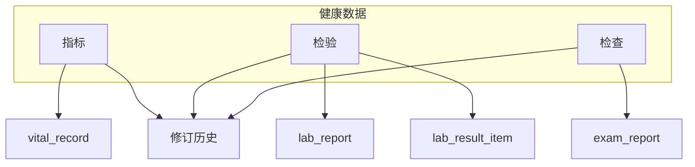

# 患者观测数据技术方案（指标 / 检验 / 检查）

> **定稿状态**：经 grill 收敛（2026-08-30）  
> **本期目标**：B 端患者级「健康数据」三类均可用——指标、检验、检查（手工录入为主；**检验单 OCR 辅助录入见** `检验单OCR-Agent技术方案.md`；无 LIS/附件）。  
> **主场景**：就诊向代录（健管师/医生一次录入）；C 端自报指标兼容已有 API。

---

## 0. 决策摘要（grill 定稿）

| 主题 | 结论 |
|------|------|
| 主场景 | 就诊向 B 端代录 |
| 本期范围 | **指标 + 检验 + 检查** 全部可用（非占位） |
| 指标默认录入 | 血压、指尖血糖、身高、体重、腰围、心率；BMI 计算展示；**不含体温**；步数/睡眠仅兼容 C 端 |
| 指标改错 | 原地 PUT + 修订历史 |
| 指标 latest | **按场景分槽**（至少血压：诊室 / 家庭） |
| 检验形态 | 报告头 + 手工明细；可选 **OCR 预填**（见检验单 OCR 方案）；无 PDF/LIS |
| 检验项目 | 核心包（见 §3.2） |
| 参考范围 | 字典默认 + 本条可改；保存时自动 H/L/N，可手改 |
| 检查形态 | 报告卡 + 少量 `findings_json`；无附件 |
| 检查类型 | 10 类，分 5 组：心电 / 超声 / 影像 / 功能 / 眼底（见 §3.3） |
| 病种目录联动 | **本期不做**（固定核心包） |
| 修订历史 | `METRIC` / `LAB` / `EXAM` 均进入同一患者时间线 |

---

## 1. 领域划分

| 分类 | 英文域 | 定义（落地口径） | 本期 |
|------|--------|------------------|------|
| **指标数据** | Metric | 物理测量、设备监测、量表；不经生物样本实验室分析 | B 端录入/列表/分槽最新值 |
| **检验数据** | Lab | 血/尿等标本实验室结果（含参考范围） | 报告头 + 明细 CRUD |
| **检查数据** | Exam | 影像/电生理/功能学报告（结论 + 关键测量） | 报告卡 + findings CRUD |

### 1.1 边界约定

| 场景 | 归类 |
|------|------|
| 诊室/家庭血压、指尖血糖 | 指标 |
| 空腹静脉血糖、HbA1c、血脂、肝肾功能、UACR | 检验 |
| ECG、彩超、肺功能、眼底、胸部影像 | 检查 |
| ABPM 原始序列 / SpO₂ / 量表 | 指标（**本期不做**，目录预留） |
| 年龄/性别 | 建档人口学，**不进观测流水** |

- C 端 `VitalService` / `/api/c/v1/vitals`：**兼容**；B 端代录 `source=STAFF`
- 不按病种硬过滤目录（本期）

---

## 2. 信息架构（B 端）

顶栏：患者档案 | 用药管理 | **健康数据** | 修订历史

**健康数据** 二级（本期均可用）：

| 二级 | 能力 |
|------|------|
| 指标 | 默认模板录入、成组血压、列表、诊室/家庭最新值、简易趋势 |
| 检验 | 新建报告、勾选/填写核心项目、参考范围与异常标记、列表/详情；**OCR 识别**（拍照预填，确认后保存） |
| 检查 | 选择类型、结论、关键 findings、列表/详情 |

路由：

- `/workspace/patients/:peopleId/observations/metrics`
- `/workspace/patients/:peopleId/observations/labs`
- `/workspace/patients/:peopleId/observations/exams`

---

## 3. 本期目录

### 3.1 指标

#### B 端默认录入模板（必做）

| 指标 | code | 单位 | 备注 |
|------|------|------|------|
| 收缩压 / 舒张压 | BLOOD_PRESSURE_SYS / DIA | mmHg | 成组；`bpContext`=CLINIC\|HOME；默认 CLINIC |
| 指尖血糖 | BLOOD_GLUCOSE | mmol/L | `mealContext`=FASTING\|POSTPRANDIAL\|RANDOM |
| 身高 | HEIGHT | cm | |
| 体重 | WEIGHT | kg | |
| 腰围 | WAIST | cm | |
| 心率 | HEART_RATE | bpm | |
| BMI | — | — | **不落库**，同组或最近身高+本次体重计算 |

#### 兼容已有 C 端（B 不主推录入）

| 指标 | code | 说明 |
|------|------|------|
| 步数 | STEPS | 可查 |
| 睡眠 | SLEEP_HOURS | 可查 |
| 体温 | TEMPERATURE | 可查；不进默认模板 |

#### 明确不做（本期）

呼吸频率、SpO₂、臀围、ABPM、mMRC/CAT、6MWT、查体定性项。

### 3.2 检验核心包

侧栏按 **临床检验常用分组** 组织（见 `frontend-admin/src/shared/lab-panels.ts`），字典 `parentCode=labItemCode`。

| 侧栏分组 | 项目 code |
|----------|-----------|
| 血脂检查 | TC, TG, LDL_C, HDL_C |
| 血糖检查 | FPG, HBA1C, INSULIN, C_PEPTIDE |
| 肾功能检查 | CR, BUN, EGFR, UA |
| 肝功能检查 | ALT, AST, GGT, ALP, TBIL, DBIL, ALB, TP |
| 血常规检查 | WBC, RBC, HGB, HCT, PLT, NEUT, LYMPH, MONO, EOS, BASO |
| 凝血功能 | PT, APTT, FIB, DDIMER |
| 电解质 | K, NA, CL, CA, P |
| 甲状腺功能 | TSH, FT3, FT4 |
| 炎症指标 | CRP, ESR |
| 肿瘤标志物 | AFP, CEA, CA199, PSA |
| 尿液检查 | UACR, URINE_PROTEIN, URINE_GLUCOSE, URINE_KETONE, URINE_BLOOD, URINE_PH, URINE_SG |

录入形态：一张 **lab_report** + 多条 **lab_result_item**（可只填本次有的项目）。

参考范围：字典 `content` 提供成人默认 `refLow`/`refHigh`/`unit`；保存时自动写 `abnormalFlag`∈{H,L,N}，允许手改。尿常规定性项（蛋白/糖/酮/潜血）为 `qualitative:true`。

### 3.3 检查类型与 findings（必做）

前端按 **辅助检查** 侧栏分组浏览与录入（与检验「实验室检查」同类交互）：

| 分组 | examType | 中文 | findings 最少字段 |
|------|----------|------|-------------------|
| 心电检查 | ECG | 心电图 | `rhythm`（SINUS/AF/OTHER）, `hasIschemiaHint`（YES/NO/NA） |
| 超声检查 | UCG | 心脏彩超 | `efPercent` |
| 超声检查 | CAROTID_US | 颈动脉彩超 | `cimtMm`, `hasPlaque`（bool） |
| 超声检查 | ABDOMINAL_US | 腹部超声 | `fattyLiver`（NORMAL/MILD/MODERATE/SEVERE/UNGRADED）, `kidneyNormal`（bool） |
| 超声检查 | THYROID_US | 甲状腺超声 | `nodulePresent`（bool）, `tiRads`（1–5/UNGRADED） |
| 影像检查 | CHEST_IMAGING | 胸部影像 | `nodulePresent`（bool） |
| 影像检查 | ABDOMINAL_CT | 腹部 CT | `lesionPresent`（bool） |
| 功能检查 | PFT | 肺功能 | `fev1Fvc`, `fev1PredPercent` |
| 功能检查 | BMD | 骨密度 | `tScore`, `zScore` |
| 眼底检查 | FUNDUS | 眼底 | `drGrade`（NONE/MILD/MOD/SEVERE/PDR/UNGRADED） |

每条报告另有：检查时间、结论文本、操作员工、机构。项目视图支持按类型直接录入并展示「最近一次」测量；「全部报告」保留列表/详情/编辑。

---

## 4. 数据模型

### 4.1 指标：增强 `vital_record`

补列（`SchemaEnsureRunner` 幂等）：

| 列 | 说明 |
|----|------|
| `org_id` | 工作机构 |
| `recorded_by_staff_id` | 代录员工 |
| `note` | 备注 |
| `group_id` | 同次测量（血压成对、身高体重同组） |

保留：`metric_type, value, unit, recorded_at, source, extra_json`

字典：`parentCode=metricType`（unit、precision、group/role、bp 相关元数据）。

**latest API**：按 `metricType`（及血压的 `bpContext`）分槽返回，避免家庭值覆盖诊室值。

### 4.2 检验：新建表

**`lab_report`**

- `id, tenant_id, people_id, org_id`
- `specimen_type`（BLOOD/URINE/…）
- `sampled_at`, `reported_at`
- `source`（MANUAL / OCR；预留 LIS）
- `note`, `created_by_staff_id`, 软删与审计时间列

**`lab_result_item`**

- `id, report_id, item_code, item_name`
- `value_num` / `value_text`（定性用 text）
- `unit, ref_low, ref_high, abnormal_flag`
- 软删与时间列

字典：`parentCode=labItemCode`，`content` 含默认单位与参考范围。

### 4.3 检查：新建表

**`exam_report`**

- `id, tenant_id, people_id, org_id`
- `exam_type`, `examined_at`
- `conclusion`, `findings_json`
- `created_by_staff_id`, 软删与审计时间列

字典：`parentCode=examType`。

本期 **无** `attachment_url` 业务（列可不建或预留不用）。

---

## 5. API（B 端）

包建议：`com.healix.web.b.observation`

### 5.1 指标 `/api/b/v1/patients/{peopleId}/metrics`

| 方法 | 路径 | 说明 |
|------|------|------|
| GET | `/` | 列表过滤 |
| GET | `/latest` | 分槽最新值 |
| POST | `/` | 单条 |
| POST | `/batches` | 成组（血压、身高体重） |
| PUT | `/{id}` | 更正 + 修订 |
| DELETE | `/{id}` | 软删；`?group=true` 成组删 |

### 5.2 检验 `/api/b/v1/patients/{peopleId}/lab-reports`

| 方法 | 路径 | 说明 |
|------|------|------|
| GET | `/` | 报告列表 |
| GET | `/{reportId}` | 报告+明细 |
| POST | `/` | 创建报告（含 items）；`source` 可选 `MANUAL`（默认）/ `OCR` |
| POST | `/ocr` | **检验单 OCR**（multipart 上传图片，同步返回预填 JSON；见 OCR 方案） |
| PUT | `/{reportId}` | 更新头+明细（整单替换或明细差分，实现选定一种并写修订） |
| DELETE | `/{reportId}` | 软删报告（级联明细） |

### 5.3 检查 `/api/b/v1/patients/{peopleId}/exam-reports`

| 方法 | 路径 | 说明 |
|------|------|------|
| GET | `/` | 列表 |
| GET | `/{id}` | 详情 |
| POST | `/` | 创建 |
| PUT | `/{id}` | 更新 + 修订 |
| DELETE | `/{id}` | 软删 |

鉴权一律：`ArchiveAccessService.assertStaffCanAccessPeople`。

### 5.4 修订

| bizType | bizKey 建议 | 摘要示例 |
|---------|-------------|----------|
| METRIC | metric 记录 id 或 groupId | 录入血压、更新指尖血糖 |
| LAB | lab_report id | 录入检验报告、更新血脂 |
| EXAM | exam_report id | 录入心电图、更新肺功能 |

前端修订页补三类中文标签与字段文案。

---

## 6. 前端交付

1. `PatientDetailLayout` 增加「健康数据」Tab（或直达 observations 子路由）
2. `PatientMetricView`：默认模板表单、成组血压、列表、诊室/家庭最新值条
3. `PatientLabView`：报告列表 + 新建/编辑（项目多选/填值）
4. `PatientExamView`：报告列表 + 按类型动态 findings 表单
5. 修订历史展示 METRIC/LAB/EXAM

---

## 7. 实现顺序

1. Schema：`vital_record` 补列 + `lab_report` / `lab_result_item` / `exam_report` + SchemaEnsure  
2. 字典：`metricType`、`labItemCode`（含 ref）、`examType`  
3. Service + 修订：Metric / Lab / Exam  
4. B Controllers  
5. 前端三页 + 修订文案  
6. C 端 vitals 回归（只保证读写兼容）

建议开发切片：**先指标打通修订与 Tab 壳 → 检验报告 → 检查报告**，避免三类并行失控。

---

## 8. 代码锚点

| 用途 | 路径 |
|------|------|
| 现有体征表 | `backend/health-app/src/main/resources/schema.sql` → `vital_record` |
| 现有服务 | `backend/health-core/.../vitals/VitalService.java` |
| C vitals | `backend/health-app/.../web/c/CPortalController.java` |
| B 只读 vitals | `BPortalController.patientVitals`（可转发新 MetricService） |
| 患者壳 | `frontend-admin/.../PatientDetailLayout.vue` |
| 修订 | `FieldRevisionService`（对齐用药 MEDICATION） |

---

## 9. 非目标（本期明确不做）

- LIS、检验 PDF 原图存储、检查影像/DICOM（**检验单 OCR 预填**见独立方案，本期不做检查单 OCR）  
- 按年龄性别动态参考范围引擎  
- 病种档案联动过滤目录  
- 指标告警、复查催办、护理任务  
- 体温进默认模板；SpO₂/量表/ABPM 录入  
- CAG/DSA 等造影深度结构化  
- 改写 C 端 Vitals UI  

---

## 10. 完整慢病目录（扩展参考，非本期必做）

文档早期整理的高血压/糖尿病/慢阻肺等扩展指标、专科检验、造影类检查，仍作为**产品扩容清单**保留在需求脑中；实现以 §3 本期目录为准，扩展时只加字典与 findings schema，不改三分法与表骨架。
