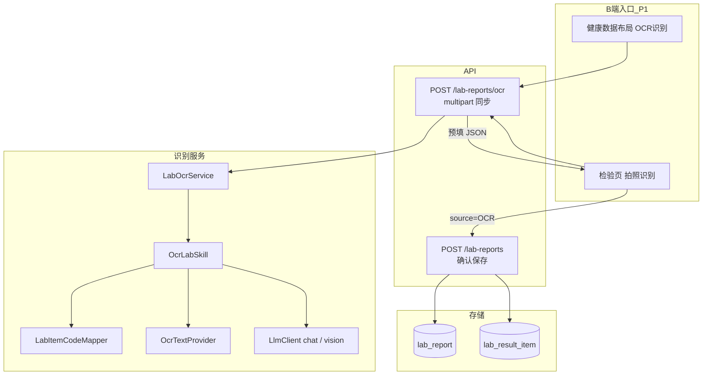

# 检验单 OCR 识别技术方案

| 项 | 内容 |
|---|---|
| 版本 | **v0.2（Grill 定稿）** |
| 日期 | 2026-08-31 |
| 状态 | **已定稿，待开发** |
| 依据 | `患者观测数据-指标检验检查.md`、`健康管理方案-Agent技术方案.md` |
| 范围 | B 端健康数据：**上传化验单图片 → 结构化识别 → 检验页人工确认 → 写入 `lab_report`** |
| 非范围 | 检查单 OCR（`OCR_EXAM` 占位）、LIS、原图持久化、自动写库、P1 通用「AI助手/智能管家」菜单 |

---

## 0. Grill 决策摘要（已定稿）

| # | 主题 | 结论 |
|---|------|------|
| G1 | 成功标准 | 能识别检验项目；识别错的在**检验页表单**修改 |
| G2 | 人机闭环 | **禁止自动写库**；员工点保存才 `POST /lab-reports` |
| G3 | 非标项目 | **不入库**；未映射字典的项**静默丢弃**，提示「已忽略 N 项」 |
| G4 | 编辑位置 | **只在检验页** `PatientLabView` 编辑与保存 |
| G5 | P1 入口 | **健康数据布局「OCR 识别」** + **检验页「拍照识别」**（同一能力） |
| G6 | 智能管家 | P1 **不做** AgentDrawer / 全局 AI 菜单；后续单独上 |
| G7 | 对外 API | `POST .../lab-reports/ocr`（**multipart 同步**） |
| G8 | 对内实现 | 复用 `OcrLabSkill` / `LabOcrService`，Agent 以后接同一 Skill |
| G9 | 识别引擎 | **可配置** `TEXT_LLM` \| `VISION`；P1 **默认 TEXT_LLM**（OCR 文本 + Chat 结构化） |
| G10 | 来源字段 | `lab_report.source`：`MANUAL` \| `OCR` |
| G11 | 保存校验 | **后端硬拦**：`itemCode` 必须在 `labItemCode` 字典内 |
| G12 | 原图 | 请求内短暂存在，识别后丢弃；不落盘、不进日志 |
| G13 | 图片限制 | jpg/png/webp；单张 ≤ 5MB；P1 仅 1 张 |

---

## 1. 产品定位

| 项 | 口径 |
|----|------|
| 主场景 | 健管师在患者「健康数据」上传化验单，辅助录入检验报告 |
| 责任边界 | OCR 只辅助录入，**不做诊断** |
| 用户路径 | 上传 → 同步识别 → 打开检验新建表单（预填）→ 修改 → 保存 |
| 数据归属 | 复用 `lab_report` + `lab_result_item`；不新建 OCR 业务表 |
| 审计 | 检验修订 `bizType=LAB`；可选记 `agent_interaction_log`（摘要，无原图） |

### 与观测数据方案的关系

- 观测方案 v1 写明「无 OCR」；本能力为 **检验录入增强**，不改表骨架。
- 仅扩展 `lab_report.source` 取值与 B 端录入入口；核心包 `labItemCode` 不变。

---

## 2. 总体架构



**数据流**：图仅在识别请求内存活；**编辑真相在检验页表单**；**持久真相在检验表**。

### P1 明确不做

- `AgentDrawer` 检验单识别快捷能力
- `POST /agent/chat/stream` 作为 OCR 主路径（留待智能管家阶段）
- 未映射项目写入 `lab_result_item`
- 检查单 `OCR_EXAM`

---

## 3. 用户路径（统一）

```
1. 用户在「健康数据 → OCR 识别」或「检验 → 拍照识别」选图
2. POST /lab-reports/ocr（loading）
3. 返回预填契约（仅含已映射 items + ignoredItems + warnings）
4. 跳转/打开检验新建表单，字段预填
5. 员工核对修改
6. POST /lab-reports（source=OCR）保存
```

未映射项：**不进入表单**；页面提示例如：「已忽略 3 项未收录项目：×××、×××」。

---

## 4. API

### 4.1 识别（P1 主接口）

| 方法 | 路径 | 说明 |
|------|------|------|
| POST | `/api/b/v1/patients/{peopleId}/lab-reports/ocr` | **multipart**：`file`（必填）；同步返回预填 JSON |

**请求**

- `Content-Type: multipart/form-data`
- `file`: 图片，jpg/png/webp，≤ 5MB

**响应** `data` 结构见 §5。

**错误**

- 无文件 / 超限 / 类型非法 → 400
- 识别引擎失败 → 502 或 503 + 明确中文文案（不 fallback 到闲聊）

### 4.2 保存（现有，增强）

| 方法 | 路径 | 说明 |
|------|------|------|
| POST | `/api/b/v1/patients/{peopleId}/lab-reports` | 请求体增加 `source`：`MANUAL`（默认）\| `OCR` |

`LabReportService.create/update`：

- 校验每条 `item.itemCode` 存在于 `labItemCode` 字典
- 非法 code → `400` + 明确错误

### 4.3 Agent 通道（P1.5+ / 智能管家）

内部 `OcrLabSkill` 与 `LabOcrService` 共用识别逻辑；未来：

- `AgentCapability.OCR_LAB` + `POST /agent/chat/stream`（SSE + extracted）
- 不在 P1 前端暴露

---

## 5. 识别输出契约

```json
{
  "specimenType": "BLOOD",
  "sampledAt": "2026-08-20T08:30:00",
  "reportedAt": "2026-08-20T16:00:00",
  "note": null,
  "items": [
    {
      "itemCode": "HBA1C",
      "itemName": "糖化血红蛋白",
      "valueNum": 6.8,
      "valueText": null,
      "unit": "%",
      "refLow": 4.0,
      "refHigh": 6.0,
      "abnormalFlag": "H"
    }
  ],
  "ignoredItems": [
    { "rawName": "某某医院特有项目", "reason": "NOT_IN_CATALOG" }
  ],
  "warnings": ["采样时间不清晰", "已忽略 1 项未收录项目"]
}
```

### 字段规则

| 字段 | 规则 |
|------|------|
| `items` | **仅含**已成功映射到 `labItemCode` 的项；供检验页预填 |
| `ignoredItems` | 未映射项；**永不落库**；用于 UI 提示 |
| `specimenType` | BLOOD / URINE；不确定 → null，表单必填 |
| 时间 | 解析失败 → null + warning |
| `abnormalFlag` | 有参考范围时服务端可重算 |

保存时映射到现有 `LabReportRequest` / `LabItemRequest`（不含 `ignoredItems`）。

---

## 6. 项目名映射

字典：`parentCode=labItemCode`（见观测方案 §3.2 核心包）。

`LabItemCodeMapper`（建议 health-core）：

1. 精确别名表（常量/配置）
2. 字典 `dictCodeDesc` / `content.aliases` 匹配
3. 规范化后模糊匹配（空格、全半角、μ→u）
4. 失败 → 进入 `ignoredItems`，**不进入 `items`**

P1 覆盖核心包常见别名即可；映射率为**优化目标**，非上线硬门槛。

---

## 7. 识别引擎

### 模式（配置 `healix.agent.ocr.mode`）

| 模式 | 流程 | P1 |
|------|------|-----|
| `TEXT_LLM` | `OcrTextProvider` → 文本 → Chat LLM → JSON | **默认** |
| `VISION` | 图 → Vision LLM → JSON | 预留，配置切换 |

### `OcrTextProvider`（可插拔）

- 接口：`String extractText(byte[] image, String mimeType)`
- 实现由配置注入（本地 Paddle / 云 OCR 等，实现期选型）
- 与 `LlmClient` 解耦，便于单测

### Vision 路径

- 复用现有 `LlmClient.chatWithImage`
- 模型：`healix.agent.models.vision`（与 chat 分离）
- 未配置或调用失败：**明确报错**，不静默降级为 GENERAL_CHAT

---

## 8. 后端改动清单

| 模块 | 改动 |
|------|------|
| `LabItemCodeMapper` | 新增；别名 + 字典匹配 |
| `LabOcrService` | 封装：读图 → Skill → 过滤未映射 → 返回契约 |
| `OcrLabSkill` | 加固 JSON 解析、映射、warnings；供 LabOcrService 调用 |
| `OcrTextProvider` | 接口 + 默认实现 + 配置 |
| `BLabReportController` | `POST .../ocr` multipart；`create` 支持 `source` |
| `LabReportService` | `source` 写入；`itemCode` 字典校验 |
| `AgentCapability` / Gateway | P1 **可不启用** OCR_LAB 对外能力；Skill 代码保留 |

### 审计（可选 P1）

- 识别请求可写 `agent_interaction_log`：`intent=OCR_LAB`，`toolCallsJson` 为 items 摘要
- **禁止**记录原图 base64

---

## 9. 前端改动清单

### 9.1 健康数据布局 `PatientObservationLayout`

- 顶栏增加 **「OCR 识别」** 按钮
- 点击：选图 → 调 `POST .../lab-reports/ocr` → 写 `sessionStorage` → 跳转 `observations/labs` 并打开新建表单

### 9.2 检验页 `PatientLabView`

- 列表/工具栏 **「拍照识别」**（同一 OCR API）
- `openCreateFromOcrDraft()`：读 sessionStorage，预填 `form` / `itemsByCode`
- 展示 `warnings` / `ignoredItems` 提示条
- 保存：`POST /lab-reports`，`source: 'OCR'`
- 免责文案：「识别结果仅供录入参考，请核对后保存」

### 9.3 P1 不做

- `AgentDrawer` 上传与 OCR 快捷能力
- 助手内联编辑检验项（统一在检验页改）

---

## 10. Skill 文档（`skills/ocr-lab/SKILL.md`）

- 只输出 JSON；禁止诊断
- 项目名尽量对应核心包 code 的中文名
- 看不清 → null + warnings
- P1 单页主表；多页 P1.5

---

## 11. 安全与合规

| 项 | 要求 |
|----|------|
| 鉴权 | JWT + `ArchiveAccessService.assertStaffCanAccessPeople` |
| 租户 | 结果仅绑定 `{peopleId}` |
| 原图 | 不落盘、不进日志 |
| 非标 | 未映射项不持久化 |
| 提示词 | 不做诊断、不推荐治疗方案 |

---

## 12. 分期

### P1（本方案）

1. `LabItemCodeMapper` + 服务端 `itemCode` 校验
2. `LabOcrService` + `POST .../lab-reports/ocr`（multipart 同步）
3. `OcrTextProvider` + 默认 `TEXT_LLM`
4. 健康数据 OCR 入口 + 检验页拍照识别 + 预填保存 `source=OCR`
5. 样张回归 + 免责文案

### P1.5

- 多图 / PDF
- `AgentCapability.OCR_LAB` + 智能管家菜单 + SSE
- Vision 模式生产可用
- 原图对象存储（可选）

### P2

- LIS
- 检查单 `OCR_EXAM`
- OCR 结果进入管理方案上下文

---

## 13. 实现顺序

```text
1. LabItemCodeMapper + LabReportService itemCode 校验 + source=OCR
2. OcrTextProvider 接口 + TEXT_LLM 默认实现 + OcrLabSkill 加固
3. LabOcrService + BLabReportController POST .../ocr
4. PatientObservationLayout OCR 入口 + PatientLabView 预填/保存
5. 样张回归 + 更新观测方案 OCR 表述
```

---

## 14. 验收标准

| # | 标准 |
|---|------|
| 1 | 上传清晰化验单，能识别并预填**至少部分**核心包项目到检验表单 |
| 2 | 识别错的项可在表单修改后正确保存 |
| 3 | 未映射项**不出现在表单**，且有「已忽略 N 项」提示 |
| 4 | 不点保存则库中**无**新 `lab_report` |
| 5 | 保存后 `source=OCR`，修订历史 `LAB` 可查 |
| 6 | 非法 `itemCode` 后端拒绝（400） |
| 7 | 识别失败有明确中文错误，不出现通用闲聊回复 |
| 8 | 日志无原图 base64 |

---

## 15. 代码锚点（现状）

| 用途 | 路径 |
|------|------|
| Skill 雏形 | `health-agent/.../skill/OcrLabSkill.java` |
| Vision 客户端 | `health-agent/.../llm/LlmClient.java` |
| 检验 CRUD | `health-core/.../observation/LabReportService.java` |
| B 检验 API | `health-app/.../observation/BLabReportController.java` |
| 检验页 | `frontend-admin/.../PatientLabView.vue` |
| 健康数据布局 | `frontend-admin/.../PatientObservationLayout.vue` |

---

**文档版本 v0.2** — Grill 定稿（2026-08-31）；可进入开发切片。
