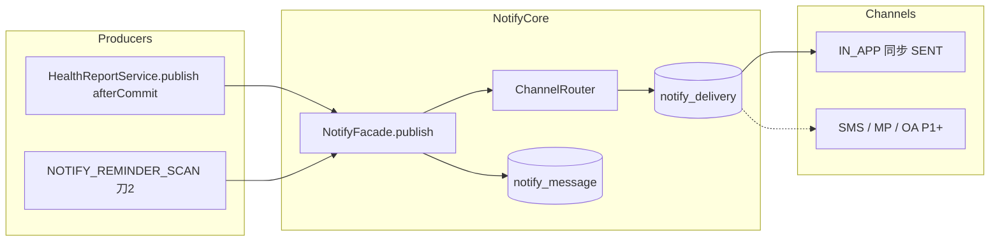

# 消息中心：产品与技术方案

| 项 | 内容 |
|---|---|
| 版本 | **v0.2** |
| 日期 | 2026-09-09 |
| 状态 | **可开发（Grill R1–R4 收敛）** |
| 依据 | `SaaS架构.md`；`C端患者激活与账号绑定.md`；`定时任务基础组件-技术方案.md`；`管理报告-产品与技术方案.md`；`依从性看板-产品与技术方案.md` |
| 入口 | C：`/notifications` + 首页/我的未读红点；B/Ops：本期无 UI |
| 范围 | **通用通知内核**（事件 → Message → 多通道 Delivery）；站内信先行；通道 SPI 可扩展小程序订阅 / 短信 / 公众号 |
| 非目标（本期） | 真实短信/微信投递；`NOTIFY_DISPATCH`；IM 私聊；邮件；营销群发；偏好页；用户删消息；Outbox 表；B 员工消息 UI |

### 命名边界

| 概念 | 说明 |
|------|------|
| **消息 / Message** | 一条逻辑通知（面向某个收件人）；站内信列表的一行 |
| **投递 / Delivery** | 某条消息在某一 **通道** 上的一次发送尝试 |
| **通道 / Channel** | `IN_APP` / `SMS` / `MP_SUBSCRIBE` / `OA_TEMPLATE` / … |
| **事件 / EventType** | 如 `REPORT_PUBLISHED`、`DAILY_HEALTH_TODO` |
| **端点 / Endpoint** | 收件人在某通道上的可达身份（openid、已验手机号）；P1 |
| **催办** | B 工作台人工跟进；**不是**本模块 |

### 变更摘要（v0.1 → v0.2 Grill）

| 点 | v0.1 | v0.2 |
|----|------|------|
| 成功标准 | 含三事件一次上 | **对外** C 站内闭环；**对内** 薄多通道核 |
| 依从事件 | `CARE_PLAN_DUE` + `MEDICATION_DUE` | 合并为 **`DAILY_HEALTH_TODO` digest** |
| 交付切片 | 一次上三事件 + Dispatch | **刀1** 内核+报告+C UI；**刀2** digest Job |
| 禁用通道 | 可插 SKIPPED Delivery | **不插入** 非启用通道行 |
| 报告事务 | afterCommit 建议 | **定稿 afterCommit**；MVP 无对账 Job |
| 幂等命中 | upsert 可选 | 报告 **忽略**；digest **可 upsert 正文且保留已读** |
| Dispatch | MVP 注册空跑 | **P1 再注册** |
| 偏好 | G9 可配 | **MVP 全开无偏好页**；P1 再做 |
| 列表/红点 | 可选按人 | 默认 **账号全部**；可选 `peopleId` 筛 |
| STAFF 主键 | 待定 | 预留 **`staff_account.id`** |
| 保留/删除 | 未钉 | MVP **不可删**；P2 再订清理 |

---

## 0. Grill 定稿口径

### 0.1 产品与模型

| # | 结论 |
|---|---|
| G1 | 内核通道无关：`notify_message` + `notify_delivery` **MVP 同建** |
| G2 | MVP 只实现 **`IN_APP`**；Router **只排已启用通道**；未启用 **不插** Delivery |
| G3 | C 收件人 = **`people_account.id`** |
| G4 | 可挂 `people_id`；文案带就诊人姓名 |
| G5 | 扇出 = 该 `people_id` 下 **全部** 未删 `account_patient` 对应账号（各一条） |
| G6 | 已读挂 Message；≠ 通道 SENT |
| G7 | 幂等 UK：`(tenant_id, audience, recipient_id, event_type, dedupe_key)` |
| G8 | 深链 = 应用内 `link_path`；外通道再映射 |
| G9 | 偏好页 **P1**；MVP 全开。日后：`SECURITY` 不可关；`REPORT` 默认不可关站内；`ADHERENCE` 可关 |
| G10 | 免打扰只约束外推；IN_APP 仍写（P1+） |
| G11 | 不与工作台催办工单合并；B 一键提醒 P2 走同一 Facade |
| G12 | `audience` 预留 `C_ACCOUNT` / `STAFF` / `OPS`；STAFF 主键 = **`staff_account.id`**；本期仅 C API/UI |
| G13 | 列表与红点 = **账号维度全部未读**；可选 `peopleId` 过滤列表 |
| G14 | 用户 **不可删** 消息（MVP） |
| G15 | 点击进深链 → **自动已读**；支持全部已读 |

### 0.2 事件与触发

| # | 结论 |
|---|---|
| G16 | **刀1**：`REPORT_PUBLISHED`（`category=REPORT`）；**增量**：`CARE_PLAN_PUBLISHED`（`category=CARE_PLAN`，方案发布 afterCommit） |
| G17 | **刀2**：`DAILY_HEALTH_TODO`（`category=ADHERENCE`）；方案未完成 **或** 用药未完成即发；无 C 关联不发 |
| G18 | 报告 `dedupe_key = reportId`；幂等命中 **忽略**（不改正文/已读） |
| G19 | digest `dedupe_key = peopleId + ':' + yyyy-MM-dd`；同日可 **upsert 正文**，**保留 `read_at`** |
| G20 | 报告：`HealthReportService.publish` **事务 afterCommit** 调 Facade；失败不回滚报告；MVP **无**对账 Job（幂等手工补调） |
| G21 | digest 深链 = **`/home`**；payload 可带 `planDue` / `medDue` 等 |
| G22 | 打卡完成后 **不**自动已读 digest |
| G23 | 时区 `Asia/Shanghai` |

### 0.3 分期

| 阶段 | 内容 |
|------|------|
| **刀1（MVP）** | 表 + Facade + Router + IN_APP Delivery；C 列表/红点/已读；报告 afterCommit 接入 |
| **刀2** | `NOTIFY_REMINDER_SCAN` + `DAILY_HEALTH_TODO` |
| **P1** | `notify_endpoint` / `notify_preference`；SMS / MP Provider；**注册 `NOTIFY_DISPATCH`**；可选报告对账 Job |
| **P2** | 公众号；B 一键提醒；STAFF 消息 UI；模板运营；保留期清理（如 180 天）；打卡后自动已读 |

---

## 1. 产品目标

### 1.1 成功标准

**刀1**

1. B 发布管理报告后，所有已关联该患者的 C 账号出现站内信，可进报告详情并自动已读。  
2. 无 C 关联 → 无消息。  
3. 同 `reportId` 重复通知 → 仍一条。  
4. 业务只调 `NotifyFacade.publish`，不碰通道 SDK。

**刀2**

5. 日批 09:00 / 20:00：有方案或用药未完成且已关联 C 的账号，至多一条当日 digest；深链首页。

### 1.2 非目标

| 项 | 说明 |
|----|------|
| 真实外发 | Provider 生产接入在 P1+ |
| Dispatch Job | P1 |
| 偏好 / 验号短信 | P1（与激活 Phase 2 对齐） |
| Outbox 表 | 不做（除非 P1.5 升级） |
| 用户删信 / 物理清理 | MVP 不做 |
| IM / 营销广播 | 另案 |

---

## 2. 总体架构



### 2.1 职责

| 层 | 职责 |
|----|------|
| Producer | 组 `PublishCommand`（事件、peopleId/收件人、文案、深链、dedupe、upsert 策略） |
| NotifyFacade | 展开收件人、幂等写 Message、按 Router 写 Delivery |
| ChannelRouter | 事件 + 平台开关（+ P1 偏好）→ 通道列表 |
| ChannelProvider | P1+ 真正外发；IN_APP 写入 Message 时即 SENT |
| NOTIFY_DISPATCH | **P1** 扫 PENDING/FAILED |

### 2.2 Message / Delivery

- 站内列表只读 Message。  
- 一消息一通道一行 Delivery；IN_APP 与 Message 同事务 `SENT`。  
- 新通道启用后 **不回放** 历史 Message。

---

## 3. 领域模型

### 3.1 受众

| audience | recipient_id | 本期 |
|----------|--------------|------|
| `C_ACCOUNT` | `people_account.id` | 实现 |
| `STAFF` | `staff_account.id` | 仅预留 |
| `OPS` | `ops_account.id` | 仅预留 |

**收件人展开**

```text
tenantId + peopleId
  → account_patient（未删）by people_id
  → distinct account_id
  → 每账号一条 Message
无账号 → 不发
```

### 3.2 事件目录

| eventType | category | 阶段 | 默认通道 | 触发 |
|-----------|----------|------|----------|------|
| `REPORT_PUBLISHED` | `REPORT` | 刀1 | IN_APP | 报告发布 afterCommit |
| `DAILY_HEALTH_TODO` | `ADHERENCE` | 刀2 | IN_APP | Reminder Job 09/20 |
| `ACTIVATION_OTP` | `SECURITY` | P1 | SMS（可无站内） | 激活验号 |
| `STAFF_NUDGE` | `ADHERENCE` | P2 | IN_APP ± SMS | B 一键提醒 |

### 3.3 通道

| channel | MVP |
|---------|-----|
| `IN_APP` | 实现 |
| `SMS` / `MP_SUBSCRIBE` / `OA_TEMPLATE` | 枚举预留，Router 不排 |

### 3.4 Delivery 状态

`PENDING` / `SENDING` / `SENT` / `FAILED` / `DEAD` / `SKIPPED`  
MVP 实际只用 `SENT`（IN_APP）。`SKIPPED` 留给 P1（无端点、偏好关闭等），**不是**「通道未启用」——未启用 = 不建行。

---

## 4. 表设计

### 4.1 `notify_message`

| 字段 | 说明 |
|------|------|
| id / tenant_id | |
| audience / recipient_id | |
| people_id / org_id | 可空 |
| event_type / category / dedupe_key | |
| title / body / link_path | |
| payload_json | 可空 |
| priority | 默认 `NORMAL` |
| read_at | 可空 |
| gmt_* / is_deleted | 软删仅系统用，用户不可删 |

**UK**：`(tenant_id, audience, recipient_id, event_type, dedupe_key)`（未删除语义按项目惯例）。

**索引**：`(tenant_id, audience, recipient_id, read_at, gmt_created)`；`(tenant_id, people_id, event_type, gmt_created)`。

### 4.2 `notify_delivery`

| 字段 | 说明 |
|------|------|
| id / tenant_id / message_id / channel | |
| status / attempt_count / next_retry_at | |
| provider / provider_msg_id / endpoint_snapshot | P1 |
| error_code / error_message / sent_at | |
| gmt_* | |

**UK**：`(message_id, channel)`。  
**索引**：`(status, next_retry_at)`（P1 Dispatch）。

### 4.3 P1 表

- `notify_endpoint`  
- `notify_preference`  

MVP **不建**。模板表 P2。

---

## 5. NotifyFacade

### 5.1 `PublishCommand`

| 字段 | 说明 |
|------|------|
| tenantId, eventType, dedupeKey, audience | 必填 |
| peopleId 与/或 recipientIds | 展开并集 |
| orgId, title, body, linkPath, payload, priority | |
| channelsOverride | 一般不传 |
| onDuplicate | `IGNORE`（报告）\| `UPSERT_BODY_KEEP_READ`（digest） |

### 5.2 步骤

1. 解析收件人。  
2. 按 UK：`IGNORE` → 返回已有；`UPSERT_BODY_KEEP_READ` → 更新 title/body/payload/link，**不清空 read_at**。  
3. Insert Message。  
4. Router → 仅启用通道；写 Delivery（IN_APP=`SENT`）。  

外通道发送不进业务线程（P1 Dispatch）。

### 5.3 C HTTP API

| 方法 | 路径 |
|------|------|
| GET | `/api/c/v1/notifications?unreadOnly&peopleId&page` |
| GET | `/api/c/v1/notifications/unread-count` |
| POST | `/api/c/v1/notifications/{id}/read` |
| POST | `/api/c/v1/notifications/read-all` |

鉴权：仅当前 `accountId`。进深链前/时前端调 read（或后端提供 read-and 无强制）。

---

## 6. 路由与反骚扰

### 6.1 Router（MVP）

| eventType | 通道 |
|-----------|------|
| `REPORT_PUBLISHED` | `[IN_APP]` |
| `DAILY_HEALTH_TODO` | `[IN_APP]` |

平台配置预留 `healix.notify.channels.*.enabled`；false → 不进入列表。

### 6.2 digest Job

| 项 | 口径 |
|----|------|
| jobCode | `NOTIFY_REMINDER_SCAN`（刀2 注册） |
| Cron | `0 0 9,20 * * *`（上海） |
| 口径 | 复用依从性 due；禁止第二套算法 |
| 门槛 | plan 未完成 **∨** med 未完成；且能展开到账号 |
| 文案 | 如「张三今日还有方案 N 项、用药未打卡」 |

### 6.3 P1 起

免打扰 22:00–08:00 只推迟外推；失败退避 1m/5m/30m/2h×5 → DEAD；无端点 SKIPPED。

---

## 7. SPI

```text
NotifyChannelProvider.channel()
NotifyChannelProvider.send(DeliveryContext) → DeliveryResult
```

MVP：`InAppChannelProvider`（可 no-op，因 Facade 已标 SENT）。  
禁止业务依赖具体 Provider。

---

## 8. 前端（C）

| 项 | 说明 |
|----|------|
| 路由 | `/notifications` |
| 入口 | 我的 + 首页铃铛红点 |
| 点击 | `read` + `router.push(linkPath)` |
| 空态 | 暂无消息 |
| 筛选 | 可选按就诊人（默认全部） |

---

## 9. 接缝

| 模块 | |
|------|--|
| 管理报告 | publish 成功 afterCommit → `REPORT_PUBLISHED` |
| 依从性 | 刀2 Job 复用 due |
| 激活 OTP | P1 SMS，可无站内 |
| 家庭账号 | `account_patient` 展开 |

---

## 10. 安全

- 行级 `tenant_id`  
- body 避免具体体征/诊断数值  
- 日志脱敏端点  
- 审计可选抽样  

---

## 11. 代码落点

```text
health-core/.../notify/
  domain, enums, mapper, service (Facade, Router, RecipientResolver)
  spi, provider/InAppChannelProvider
health-app/.../web/c/CNotificationController.java
刀2: NotifyReminderScanJobHandler → JobCatalog
P1: NotifyDispatchJobHandler
```

---

## 12. 验收

### 刀1

| # | 期望 |
|---|------|
| 1 | 无 C 关联发布 → 无消息 |
| 2 | 两家属账号 → 各 1 条 IN_APP SENT |
| 3 | 同 reportId 再通知 → 仍 1 条且已读不变 |
| 4 | 点进详情 → 已读；红点 -1 |
| 5 | 越权 messageId → 403/404 |
| 6 | 报告事务回滚 → 无消息；afterCommit 前崩溃 → 可手工补调幂等 |

### 刀2

| # | 期望 |
|---|------|
| 7 | 仅方案未完成 → 1 条 digest，link=/home |
| 8 | 同日 9 点与 20 点 → 1 条；正文可更新；已读不回退 |
| 9 | 打完卡后未读 digest 仍在，直到用户读 |

---

## 13. 实现任务

**刀1**

1. DDL + SchemaEnsure：`notify_message` / `notify_delivery`  
2. 枚举 + Mapper + Facade + Router + RecipientResolver + InApp  
3. C API + 前端列表/红点/已读  
4. 报告 publish afterCommit 接入  

**刀2**

5. `NOTIFY_REMINDER_SCAN` + `DAILY_HEALTH_TODO` 文案/payload  

**P1**

6. endpoint / preference / SMS / MP；注册 `NOTIFY_DISPATCH`；可选对账  

---

## 14. 风险

| 风险 | 缓解 |
|------|------|
| afterCommit 丢通知 | 幂等补调；量小可接受 |
| digest 扫全表慢 | 先收缩有 ACTIVE 方案/用药集合 |
| 家属打扰 | 文案带姓名；P1 可关 ADHERENCE |
| 与催办混淆 | UI 称「消息/提醒」 |

---

**文档状态**：v0.2 **可开发**。Grill 关闭。动手写代码前请另发实现指令（建议先刀1）。
