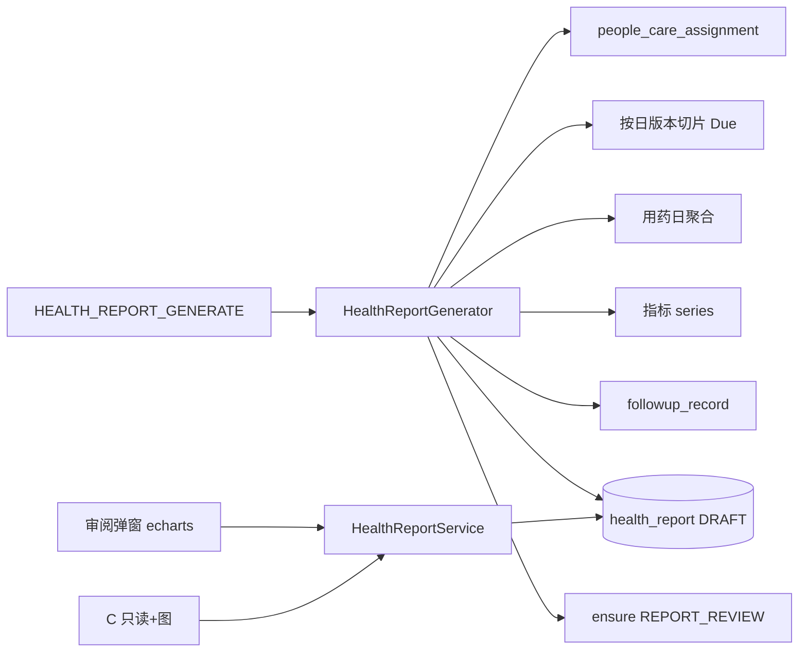

# 管理报告：产品与技术方案

| 项 | 内容 |
|---|---|
| 版本 | **v0.2** |
| 日期 | 2026-09-08 |
| 状态 | **已落地（周/月/季；周报按入组日错开）** |
| 依据 | `工作台任务-技术方案.md` P2；`依从性看板-产品与技术方案.md`；`随访-产品与技术方案.md`；`数据模型.md` |
| 入口 | B：患者详情 Tab「管理报告」+ 工作台 `REPORT_REVIEW` 弹窗审阅；C：列表+详情（仅 `PUBLISHED`） |
| 范围 | 周报 / 月报 / 三个月报告；结构化快照；审阅发布；定时出报；前端图表 |
| 非目标（本期） | PDF 导出、短信/企微推送、自动免审发布、发布后勘误、Agent 对话替代本模块、服务端渲图存档 |

### 命名边界

| 概念 | 说明 |
|------|------|
| **管理报告** | 本方案：周期健康管理汇总（周/月/季） |
| 检验/检查报告 | 已有 `lab_report` / `exam_report`，**不是**本模块 |
| **主管机构 / 主管健管师** | 已有 `people_care_assignment.primary_org_id` / `primary_care_manager_staff_id`（非新造「责任机构」） |
| 预留表 `health_report` | 原上传文件元数据语义废弃，**改造为本模块主表** |

### 变更摘要（v0.1 → v0.2）

| 点 | v0.1 | v0.2（Grill） |
|----|------|----------------|
| 主成功标准 | 未强调 | **C 端交付**优先 |
| 出报门槛 | 方案或用药或≥1体征 | **方案 due>0 或用药 due 日>0**；无空壳 |
| 无主管 assignment | 回落到任意 membership | **不出报** |
| 机构范围 | 含糊 | **仅主管机构**审/发；Job 只扫主管机构患者 |
| 方案版本口径 | 未钉 | **按日切片**生效版本算 due（MVP 硬上） |
| 寄语 | 选填 | 选填；空则 C 端 **分档模板** |
| 指标展示 | 数字 | **有数据出图**（echarts，仅前端） |
| 发布 | 未强调领取 | **须先 claim**（或已分派） |
| SKIPPED | 可跳过 | 占唯一键；误操作 → **原处理人/租户管理员 VOID** 再生 |

---

## 0. Grill 定稿口径

### 0.1 产品与权限

| # | 结论 |
|---|---|
| G1 | 主成功标准 = **C 端可读周报**（数字 + 图 + 寄语/模板），非纯 B 履职留痕 |
| G2 | 必须人工审阅后 `PUBLISHED` 才对 C 可见；禁止自动发布 |
| G3 | 一人一单 `REPORT_REVIEW`（不与汇总单混用） |
| G4 | 报告 `org_id` = **主管机构** `primary_org_id`；仅该机构可生成任务、审阅、发布 |
| G5 | 其他有 membership 的机构：可见 **已发布**只读；不可见 DRAFT/SKIPPED |
| G6 | 无 `people_care_assignment` → **不出报** |
| G7 | 有主管机构、无主管健管师 → 任务进该机构 **公共池**（医生公共池不可见，对齐 `PLAN_CREATE`） |
| G8 | 医生：公共池不见；被分派才可在「我的待办」处理 |
| G9 | 发布/跳过须 **先领取**（或已是 assignee） |
| G10 | `staffComment` 选填；为空时 C 端用完成率 **分档模板**（有方案用方案 rate，否则用药 rate；≥0.8 / 0.5–0.8 / \<0.5） |
| G11 | `nextFocus` 选填 |
| G12 | 审阅弹窗提示「建议先刷新快照」；`PUBLISHED` **冻结**，本期不做勘误 |
| G13 | `SKIPPED` 占周期唯一键（=本周期结案）；VOID 权限 = **原处理人 + 租户管理员**（DRAFT/SKIPPED） |
| G14 | 工作台详情 = **弹窗**，不强制跳患者列表页 |
| G15 | C 端 MVP = 独立列表+详情路由；**首页卡片 P1** |

### 0.2 生成与口径

| # | 结论 |
|---|---|
| G16 | 时区 `Asia/Shanghai` |
| G17 | 唯一键 `(tenant_id, people_id, period_type, period_start)`（未删除） |
| G18 | MVP **周报**；月/季共用引擎，Job params 开关 |
| G19 | 周报门槛：周期内 **方案 dueCount>0 或用药 dueDayCount>0**；不因「仅有体征」出报 |
| G20 | `SKIPPED` ≠ 数据不足；数据不足 = **不生成** |
| G21 | 方案依从：**按自然日**取当日生效版本（`published_at` 区间）算 due，再加总 |
| G22 | Job 按机构扫描时只处理 `primary_org_id = 当前机构` 的患者 |
| G23 | 手工可指定已结束的 `periodStart` 补历史；**禁止**对未结束周期出报 |
| G24 | 周报指标：有测量的族出 **折线**（异常点高亮）；执行 `daily` 出柱状；无数据不展示该图 |
| G25 | 图表仅前端 echarts 渲染，不落库截图 |
| G26 | 周报不含检验检查；月报/三月报含摘要 |
| G27 | 三月报必含 `quarterAdvice`（含 `suggestPlanAdjust`，可联动 `PLAN_CREATE`） |
| G28 | AI 摘要 P1+；MVP 不接 LLM |

---

## 1. 产品目标

### 1.1 一句话

按自然周 / 自然月 / 自然季度，把患者「方案执行 + 用药依从 + 指标变化 + 随访干预」收成一份 **患者可读**报告（含图表）；主管机构健管师审阅后发布。

### 1.2 成功标准（MVP = 周报）

1. 上周结束后，符合门槛且有主管机构的患者生成 `DRAFT` + `REPORT_REVIEW`  
2. 主责（或公共池领取后）弹窗审阅：可刷新快照 → 发布/跳过  
3. C 端仅见 `PUBLISHED`（数字 + 图 + 寄语或分档模板）  
4. 方案完成率与按日切片 due 口径一致；与 C 端打卡规则同源  

---

## 2. 用户与场景

| 角色 | 用法 |
|------|------|
| 健管师（主管机构） | 周一处理审阅弹窗；患者 Tab 看历史；误 SKIPPED 可 VOID 再生 |
| 医生 | 默认可读已发布；公共池不领报告单；被分派则可审 |
| 患者（C） | 列表+详情看已发布 |
| 租户管理员 | 主管机构内可代审；可 VOID |

```text
Job（仅主管机构患者）→ DRAFT + REPORT_REVIEW（指派主责或公共池）
  → claim →（可选刷新快照）→ publish / skip
  → C 可见 PUBLISHED
```

---

## 3. 周期与门槛

| `periodType` | 区间 | Job 触发 | 人群门槛（均需已有主管 assignment） |
|--------------|------|----------|--------------------------------------|
| `WEEK` | 周一～周日 | 「昨天」为周日时生成上周 | 周期内方案 **dueCount>0** 或用药 **dueDayCount>0** |
| `MONTH` | 自然月 | 每月 1 日生成上月 | 同上 + 本机构入组 ≥14 天 |
| `QUARTER` | 自然季 | 季首日生成上季 | 入组 ≥60 天，且本季有方案或 ≥2 条已办结随访 |

- 仅 `period_end < today`（上海日历）可生成。  
- 标题：`{yyyy}年W{ww}周管理报告` 等。

### 章节与展示

| 章节 | 周报 | 月报 | 三月报 |
|------|------|------|--------|
| 执行依从 | 率 + **每日柱图** | ✓ | ✓ + 对比上期 |
| 指标 | 有数据族：**折线** + 最近值/异常数 | + 趋势加长 | + 阶段变化 |
| 随访/干预 | 列表 | 汇总 | 汇总 |
| 检验/检查 | ✗ | 摘要 | 摘要 |
| 寄语 | 人工或分档模板 | 同 | 同 |
| 阶段建议 | `nextFocus` 选填 | 中 | **必填** `quarterAdvice` |

---

## 4. 信息架构

**B**

- 患者详情 Tab「管理报告」：列表（本机构视角）+ 详情/审阅弹窗  
- 工作台 `REPORT_REVIEW`：详情 = 同一套审阅弹窗  

**C**

- `/health-reports` 列表 + `/health-reports/:id` 详情（MVP）  
- 首页入口 → P1  

外机构工作人员打开患者页：列表仅 `PUBLISHED`（若产品允许跨机构只读档案）；不可 publish。

---

## 5. 状态机

```text
generate → DRAFT ⇄ refresh(content)
              ├─ publish → PUBLISHED（冻结）
              ├─ skip    → SKIPPED（占唯一键）
              └─ void    → 软删，可同周期再生
```

| 状态 | 含义 |
|------|------|
| `DRAFT` | 待审；可刷新 |
| `PUBLISHED` | 对 C 可见；content 冻结 |
| `SKIPPED` | 有内容但不发 C；本周期不再 Job 生成 |
| （VOID） | 软删实现，释放唯一键 |

关任务：publish/skip → `DONE`+`FORM`；void → 任务 `CANCELLED`。

---

## 6. 内容 Schema（`content_json`）

`schemaVersion = 1`。生成写全量快照；审阅可改 `narrative.staffComment` / `nextFocus` /（季）`quarterAdvice`。

要点字段同 v0.1 示例，并明确：

- `adherence.plan.daily[]`：供柱图  
- `metrics[].series[]`：供折线；`abnormal` 标记可选  
- `profile.planVersionsInPeriod[]`（建议）：本周涉及的 `versionNo` + 生效日期范围，便于审计按日切片  
- `narrative.templateTier`：发布时若无人工寄语，服务端可写入 `GOOD|FAIR|POOR` 供 C 选文案；或 C 端按 rate 现算  

### 按日切片算法（方案 due）

1. 列出患者 `care_plan_version`，按 `published_at` 排序  
2. 对周期内每个日历日 `d`：取满足 `published_at ≤ endOf(d)` 的最新版本 V（且计划仍 ACTIVE/在 horizon 内按现有 Due 规则）  
3. 用 V 的 `care_plan_task` + 当日 checkin 算 due/done/skipped  
4. 加总得周期 `dueCount` / `doneCount` / `rate`  

用药：与依从性看板「用药日达标」同一规则，按日加总。

### 分档模板（C，寄语为空时）

| tier | 条件 | 示例文案（可配置） |
|------|------|-------------------|
| GOOD | rate ≥ 0.8 | 本周期执行情况良好，请继续按方案与用药计划坚持。 |
| FAIR | 0.5 ≤ rate \< 0.8 | 本周期部分任务未完成，建议按方案补齐打卡并监测关键指标。 |
| POOR | rate \< 0.5 | 本周期执行偏弱，请尽快与健管师沟通，调整节奏或方案。 |

rate 选取：有方案 due>0 → 用方案 rate；否则用用药 rate。

---

## 7. 技术方案



| 组件 | 职责 |
|------|------|
| `health-core/.../report/` | 生成、发布、查询、模板 tier |
| `WorkspaceTaskGenerator.ensureReportReview` | 开单/指派 |
| `HealthReportGenerateJobHandler` | 日批 |
| 前端共用 `HealthReportDetailPanel` | B 审阅 / C 只读 / 图表 |

### 幂等与 Job

- 已存在 DRAFT/PUBLISHED/SKIPPED → Job 跳过  
- 手工刷新：仅 DRAFT  
- 手工 generate：`periodStart` 可选；校验周期已结束；非主管机构 403  
- Job：机构维度只处理 `primary_org_id = orgId`  

### 分派

- `assignee_staff_id` = `primary_care_manager_staff_id`（可空 → 公共池）  
- 公共池排除医生（同 `PLAN_CREATE`）  

---

## 8. 数据模型（`health_report` 改造）

| 列 | 说明 |
|----|------|
| `tenant_id` `people_id` | 租户共享患者维 |
| `org_id` | **主管机构**，任务与审阅边界 |
| `care_team_id` | 可空 |
| `period_type` / `period_start` / `period_end` | 周期 |
| `title` `status` `schema_version` | DRAFT/PUBLISHED/SKIPPED |
| `content_json` | §6 |
| `staff_comment` | 冗余，列表用 |
| `workspace_task_id` | |
| `published_at` / `published_by_staff_id` | |
| `generated_by` | JOB / MANUAL |
| 标准软删列 | VOID = 软删 |

唯一：`uk_report_period (tenant_id, people_id, period_type, period_start, gmt_deleted)`。

`workspace_task`：`task_type=REPORT_REVIEW`，`biz_key=health_report.id`，payload 含 period 字段。

---

## 9. API

### B `/api/b/v1`

| 方法 | 路径 | 说明 |
|------|------|------|
| GET | `/patients/{peopleId}/health-reports` | 列表；非主管机构仅 PUBLISHED |
| GET | `/health-reports/{id}` | 详情 |
| POST | `/patients/{peopleId}/health-reports/generate` | `{ periodType, periodStart? }`；主管机构；周期已结束 |
| POST | `/health-reports/{id}/refresh` | 仅 DRAFT 重算快照 |
| POST | `/health-reports/{id}/publish` | 须 assignee；`{ staffComment?, nextFocus?, quarterAdvice? }` |
| POST | `/health-reports/{id}/skip` | 须 assignee；`{ reason? }` |
| POST | `/health-reports/{id}/void` | DRAFT/SKIPPED；原处理人或租户管理员 |

工作台：claim 后走 publish/skip；已办详情弹窗只读或带报告 id。

### C `/api/c/v1`

| 方法 | 路径 | 说明 |
|------|------|------|
| GET | `/health-reports` | 当前就诊人 PUBLISHED |
| GET | `/health-reports/{id}` | 只读；含图表所需 series |

---

## 10. 定时任务

| 项 | 值 |
|----|-----|
| `jobCode` | `HEALTH_REPORT_GENERATE` |
| Cron | `0 30 0 * * *` |
| params | `{ "enableWeek": true, "enableMonth": false, "enableQuarter": false, "batchSize": 200 }` |

每日：enableWeek 且昨天为周日 → 为各机构生成「上周一～日」报告（仅 primary_org 匹配患者）。

---

## 11. 前端

| 端 | 项 |
|----|-----|
| B | Tab + 列表；`HealthReportReviewDialog`（刷新提示、图、发布/跳过/VOID） |
| B | `WorkspaceTasksView`：`REPORT_REVIEW` → 同弹窗 |
| C | 列表+详情页；echarts 复用 series；无寄语用分档文案 |
| 共用 | 详情面板组件，避免 B/C 两套 UI |

---

## 12. 分期

| 阶段 | 内容 |
|------|------|
| **MVP** | 表改造；按日切片周报；Job；B Tab+审阅弹窗+图；工作台任务；C 列表详情+图；分档模板；无 AI |
| **P1** | 月报；C 首页入口；可选 AI 摘要 |
| **P2** | 三月报 + `quarterAdvice`→`PLAN_CREATE`；PDF |

---

## 13. 验收用例（MVP）

| # | 用例 | 期望 |
|---|------|------|
| 1 | 有主管、上周方案 due>0，周一 Job | 1 条 DRAFT + OPEN REPORT_REVIEW 挂主管机构 |
| 2 | 仅有体征、无方案/用药 due | **不生成** |
| 3 | 无 care_assignment | **不生成** |
| 4 | 再跑 Job | 不重复 |
| 5 | 未 claim 发布 | 400 |
| 6 | claim 后发布 | PUBLISHED；C 可见；有图（若有 series） |
| 7 | 寄语为空发布 | C 显示分档模板 |
| 8 | skip | SKIPPED；C 不可见；Job 不再出该周 |
| 9 | 原处理人 VOID 后再 generate | 新 DRAFT |
| 10 | 周中改方案版本 | 完成率按日切片，与手工按日加总一致 |
| 11 | 非主管机构 publish | 403 |
| 12 | 手工生成「本周未结束」 | 400 |
| 13 | 医生公共池 | 不见 REPORT_REVIEW |
| 14 | 无主责健管师 | 公共池可领后发布 |

---

## 14. 交叉引用

- `工作台任务-技术方案.md` §P2 → 本文  
- `数据模型.md`：`health_report` = 管理报告  
- 落地时同步 `schema.sql` / ER  

---

## 15. 落地顺序

1. Schema 改造 `health_report`  
2. 按日切片聚合 + Generator（周报）  
3. B/C API + `ensureReportReview` + claim 校验  
4. Job `HEALTH_REPORT_GENERATE`  
5. B Tab / 审阅弹窗 / 图表；C 列表详情 / 图表 / 分档文案  
